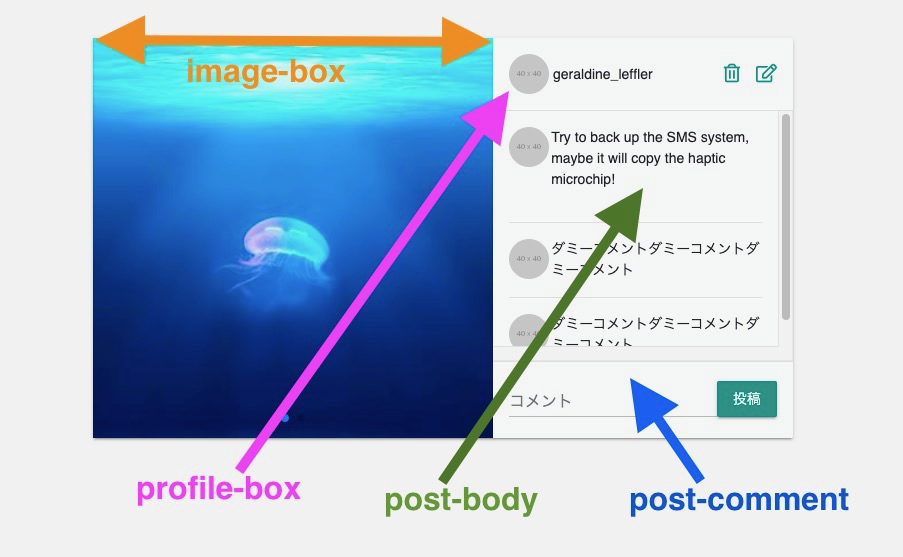

# Issue02 投稿のCRUD機能実装

## 求められている機能実装について

1. 投稿のCRUD機能実装
2. その他設定を行ってください
    - ユーザーとポストのシードファイルを作る
    - その際fakerを使ってダミーテキストを生成する
    - 画像のアップロードにはcarrierwaveを使用する
    - image_magickを使用して、画像は横幅or縦幅が最大1000pxとなるようにリサイズする
    - 画像は複数枚アップロードできるようにする
    - Swiper使って画像をスワイプできるようにする
    - 諸々のアイコンにはfontawesomeを使用する（おそらく導入済）

### 分からない単語・概念等の一覧

- carrierwave
- image_magick
- faker
- swiper
- fontawesome

## Carrierwave

今回の核となる実装。  
別ファイルにまとめた。  

複数枚のアップロード方法についてもまとめた。  

[CarrierWaveについてのノート](02_issue_note_carrierwave.md)  

## image_magick

`MiniMagick`と`RMagick`がある。  
公式では、"MiniMagick is recommended."と書いてある。  

今回は、あくまで`CarrierWave`の中でアップローダの中で設定するだけに留まる。  

[CarrierWave\+MiniMagickで使う、画像リサイズのメソッド \- Qiita](https://qiita.com/wann/items/c6d4c3f17b97bb33936f)  

## faker

ダミーデータを自動生成してくれるもの。  

使い方は非常にシンプル。  
GitHubのReadmeを読むと、異常なほどのダミーが作れることにビビる。  

わかりやすいので、英語でもこれは公式を読んでもいける！  

> [Github: faker\-ruby/faker](https://github.com/faker-ruby/faker)  
> [Fakerを使ってみました！（使い方と実行例） \- Qiita](https://qiita.com/ginokinh/items/3f825326841dad6bd11e)

## swiper

すごいサイトがあった。  
めちゃくちゃ分かりやすい。  

> [サンプル付き！簡単にスライドを作れるライブラリSwiper\.js超解説（基礎編） \| ガリガリコード](https://garigaricode.com/swiper/)

今回の場合、この仕組みさえ分かれば、解読できる。  

```html
<!-- Swiper START -->
<div class="swiper-container">
	<!-- メイン表示部分 -->
	<div class="swiper-wrapper">
		<!-- 各スライド -->
		<div class="swiper-slide">Slide 1</div>
		<div class="swiper-slide">Slide 2</div>
		<div class="swiper-slide">Slide 3</div>
		<div class="swiper-slide">Slide 4</div>
	</div>
	<div class="swiper-pagination"></div>
</div>
<!-- Swiper END -->
```

また、設定方法については以下を参照した。  

> - [公式サイト：Getting Started With Swiper](https://swiperjs.com/get-started/)  
> - [swiperをyarnで導入して、画像をスライダー形式にする！ \- Qiita](https://qiita.com/kenkentarou/items/bdf04d8ecab6a855e50f)  

## fontawesome

以下の記事が簡潔にまとめている。

> [RailsでFontAwesomeの導入〜大きさを変えるまで \- Qiita](https://qiita.com/OneRoomBoy-TK/items/b837f438a49e70b29991)  

例えば、以下のフォントを使いたい場合、  
`far`,`fa-futbol`というクラスを指定してあげればよい。  

[Futbol Icon \- Regular \| Font Awesome](https://fontawesome.com/icons/futbol?style=regular)  

## 投稿のCRUD機能実装

これからコントローラとモデル関係の実装を追っていく。  

### ルーティング

ベタにresourceを使って、7つのアクションを設定する。  

### モデル

画像投稿用のPostというモデルを作成する。  

投稿にあたっては、画像とメッセージの投稿はマストとしている。  
また、メッセージの長さは1,000文字以下となっている。  

```rb: Post.rb
# == Schema Information
#
# Table name: posts
#
#  id         :bigint           not null, primary key
#  body       :text(65535)      not null
#  images     :string(255)      not null
#  created_at :datetime         not null
#  updated_at :datetime         not null
#  user_id    :bigint
#
# Indexes
#
#  index_posts_on_user_id  (user_id)
#
# Foreign Keys
#
#  fk_rails_...  (user_id => users.id)r

class Post < ApplicationRecord
  # userモデルに紐づける
  belongs_to :user
  
  # アップローダと連携する為に必要
  # 複数の画像が投稿できるよう、mount_uploader's'とする
  mount_uploaders :images, PostImageUploader
  
  # JSON形式で保存する為に必要
  # Rails5以上の場合、不要との情報もあったが。。。
  serialize :images, JSON

  validates :images, presence: true
  validates :body, presence: true, length: { maximum: 1000 }
end
```

### コントローラ

7つのアクションについて、よくあるような設定を行う。
- index
  - 投稿データの一覧を表示（作成日順）
- create
  - current_userに紐づく形でデータを保存
  - 成功した場合と失敗した場合で分岐させる
- new
  - 空のpostインスタンスを生成
- edit
  - current_userに紐づく形で該当データを表示
- show
  - 該当データを表示
- update
  - current_userに紐づくデータを更新
  - 成功した場合と失敗した場合で分岐させる 
- destroy
  - current_userに紐づくデータを削除

5つのアクション（new create edit update destroy）についてはログインしないと実行できないものとする。  
そのため、`require_login`を before action で設定する。  

## View関係の実装

コードを見ても、何がどうなっているのか解読が難しかったので、  
愚直に画面に対応関係を記してみた。  

editのコードはシンプルだったので、画像だけ貼り付けた。  
なお、newのコードはeditと変わらない。  

【index】<br>
<br>

【show】<br>
<br>

【edit】（new)<br>
<br>

## 外部キー制約

[外部キー制約について \- Qiita](https://qiita.com/SLEAZOIDS/items/d6fb9c2d131c3fdd1387)  


## 動作確認方法

1. git clone https://github.com/miketa-webprgr/instagram_clone.git
2. git checkout git checkout -b feature/01_login_logout origin/feature/01_login_logout
3. bundle install
4. yarn install
5. MySQL と Redis を立ち上げる
