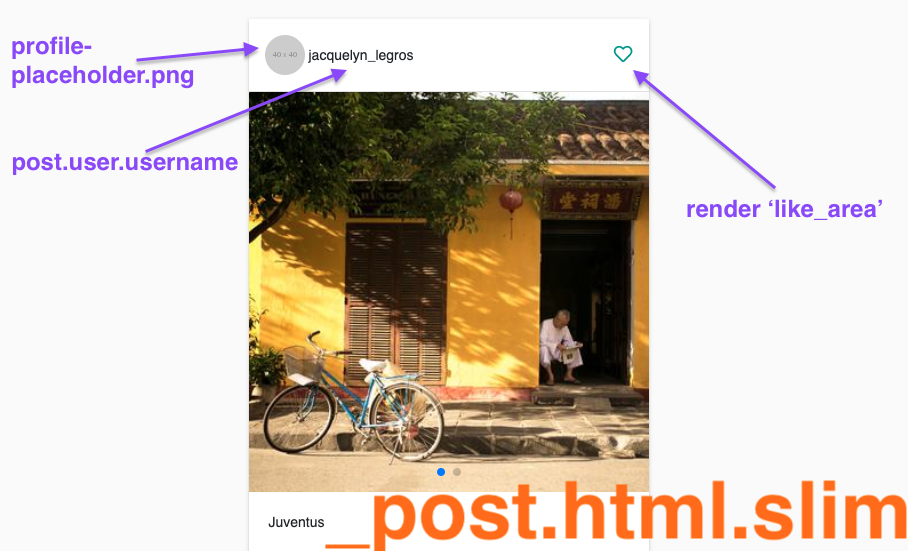
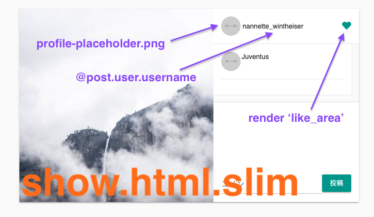

# Issue05 投稿に対するいいね機能を実装

## どんな感じ？

<a href="https://gyazo.com/d5eca6e3b281897fb3086a973d48cfb3"></a><br>  

<a href="https://gyazo.com/ee0c03fa2d4b4ed8bfe8f901262bb492"></a><br>  

## 求められている機能実装・実装条件についてについて

1. 投稿に対するいいね機能を実装
2. link_toを使って非同期処理として実装する
3. like, unlike, like?メソッドをユーザーモデルに実装してそれを利用する形にする
4. Likeモデルに適切なバリデーションを付与する

## 分からない単語・概念等の一覧

### 多対多のassocationについて

こちらの記事を熟読することから始めた。  

- [【初心者向け】丁寧すぎるRails『アソシエーション』チュートリアル【幾ら何でも】【完璧にわかる】🎸 \- Qiita](https://qiita.com/kazukimatsumoto/items/14bdff681ec5ddac26d1#user%E3%81%A8user%E3%81%AE%E5%A4%9A%E5%AF%BE%E5%A4%9Amn%E3%82%92%E8%A8%AD%E8%A8%88%E3%81%97%E3%82%88%E3%81%86%E8%87%AA%E5%B7%B1%E7%B5%90%E5%90%88)

多対多の関係は、今回のようないいね機能を考えてみると分かりやすい。  

投稿は、たくさんのユーザーからいいねされる可能性がある。  
Post has many users と捉えることができる。  

他方、ユーザーは多くの投稿をいいねすることができる。  
User has many posts と捉えることができる。  

この関係は、中間テーブルとして表現される。  
詳しくはQiita記事のとおりだが、いいね（Like)テーブルには以下のカラムが設けられる。  

- id
- user_id
- post_id

`user_id: 1`が`post_id: 9`をいいねすれば、その関係自体に`id: 1`が付与され、  
Likeテーブルに保存される。逆も然りで、`post_id :9`が`user_id: 2`にいいねされれば、  
同様にその関係自体に`id: 2`が付与され、Likeテーブルに保存される。  

## 具体的な実装手順について

いいね機能実装にあたっては、以下の手順に従って行う必要がある。  

1. Likeモデルの作成とassociationの設定
2. Likeモデルに適切なバリデーションを付与する
3. like, unlike, like?メソッドの作成（Userモデルでロジックを実装）
4. viewの実装
5. Create + Destroy 機能（非同期）実装のための`js.slim`ファイル作成

### 1. Likeモデルの作成とassociationの設定

以下のコマンドにてLikeモデルを作成するマイグレーションファイルを作成する。

```rb
rails g model like user:references post:references
```

このコマンドにより、以下のファイルが生成される。  

```rb:like.rb
# like.rb
class Like < ApplicationRecord
  belongs_to :user
  belongs_to :post
end
```

```rb:migration.rb
# 20200720140202_create_likes.rb
class CreateLikes < ActiveRecord::Migration[5.2]
  def change
    create_table :likes do |t|
      t.references :user, foreign_key: true
      t.references :post, foreign_key: true

      t.timestamps
      # このユニーク制約については、手動で追記
      # この設定により、いいねが2回できないようになる
      t.index [:user_id, :post_id], unique: true
    end
  end
end
```

マイグレーションファイル作成後、`rails db:migrate`を実行する。  

Likeモデルを作成する際には、外部キーを２つ指定する形となるので、  
`belongs_to :user`と`belongs_to :post`と書く。

また、UserモデルとPostモデルで`has_many :likes`と書く。  

いいねしたpostを取得する場合、モデルで定義しておくと簡単にコントローラで記述することができる。  
具体的には以下のようなコードになる。  

```rb:user.rb
# user.rb
class User < ApplicationRecord
  has_many :posts
  has_many :likes
  # like_postsという独自カラム？を設ける。user.likesとすることで、いいねした投稿を取得できる。
  has_many :like_posts, through: :likes, source: :post
end
```

Postモデルでも同様の記述をする。  
これにより、この投稿をいいねしたuserを取得することが容易になる。  

```rb:post.rb
# post.rb
class Post < ApplicationRecord
  belongs_to :user
  has_many :comments, dependent: :destroy
  has_many :likes, dependent: :destroy
  has_many :like_users, through: :likes, source: :user
  # その他に書いた設定については省略。ここではassociation関連の記述のみ掲載。
end
```

### 2. Likeモデルに適切なバリデーションを付与する

既に設定済だが、データベース上でユニーク制約をかけることにより、  
同じuser_idとpost_idの組み合わせは保存できないようになった。  
このことにより、いいねが２回できないようになった。  

合わせて、データベースだけでなく、モデルでのバリデーションを設定する必要がある。

その際には、こちらの記事を参照するとよい。  
- [Railsで2つ以上の値の組み合わせに対するユニーク制約をかける \- Qiita](https://qiita.com/wadako111/items/958dded40a840c35c5ec)  

具体的には、Likeモデルで以下のように記述する。  

```rb:like.rb
# like.rb
class Like < ApplicationRecord
  belongs_to :user
  belongs_to :post

  validates :user_id, uniqueness: { scope: :post_id }
end
```

### 3. like, unlike, like?メソッドの作成（Userモデルでロジックを実装）

可読性を向上し、ロジックをビューに書かないために、以下のメソッドを定義するとよい。  

- 投稿をいいねするメソッド
- 投稿のいいねを解除するメソッド
- 投稿をいいねしているか確認するメソッド

具体的には以下のとおりのコードとなる。  

```rb
# user.rbに以下を記載
def like(post)
  like_posts << post
end

def unlike(post)
  like_posts.destroy(post)
end

def like?(post)
  like_posts.include?(post)
end
```

### 4. viewの実装

いいね機能は、投稿の一覧画面(`index.html.slim`）と投稿の詳細画面（`show.html.slim`）で実装される。  

`index.html.slim`における投稿の画面は、`_post.html.slim`のパーシャルによって表示されている。  
そちらを参照し、どのようなコードとなっているか確認する。  

### `_post.html.slim`

いいね機能に該当する部分の構成は、下記のとおりとなっている。  

<br>  

コードは下記のとおりである。  

```_post.html.slim
.card.mb-5.post
  .card-header
    .d-flex.align-items-center
      = image_tag 'profile-placeholder.png', size: '40x40', class: 'rounded-circle mr-1'
      = post.user.username
      - if current_user&.own?(post)
        .ml-auto
          = link_to post_path(post), class: 'mr-3', method: :delete, data: { confirm: '本当に削除しますか？' } do
            = icon 'far', 'trash-alt', class: 'fa-lg'
          = link_to edit_post_path(post) do
            = icon 'far', 'edit', class: 'fa-lg'
      - if current_user && !current_user.own?(post)
        .ml-auto
          /ここでいいね機能が実装される
          = render 'like_area', post: post
〜省略〜
```

### `_like_area.html.slim`

コードは下記のとおりとなっている。  

```_like_area.html.slim
/ _like_area.html.slim
div id="like_area-#{post.id}"
  - if current_user.like?(post)
    = render 'unlike', post: post
  - else
    = render 'like', post: post
```

`like?`メソッドは、いいねした投稿であるか確認するメソッドである。  

投稿をいいねしていれば、`unlike`をrenderする。  
投稿をいいねしていなければ、`like`をrenderする。  

### _unlike.html.slim`と`_like.html.slim`

`_unlike.html.slim`は下記のとおりとなっている。  
current_userが持つlikeの中から、該当の投稿に対するものを削除する。  

この場合、いいねされている状態のハートを表示する必要があるので、  
`icon 'fa', 'heart'`という色が塗られた状態のハートを表示する。  

また、`/likes/:id(.:format)`というURIにアクセスする必要があるため、  
likesの`id`を取得するため、下記のとおり`current_user.likes.find_by`とする。  

```slim:_unlike.html.slim
/ _unlike.html.slim
= link_to like_path(current_user.likes.find_by(post_id: post.id)), method: :delete, remote: true do
  = icon 'fa', 'heart', class: 'fa-lg'
```

`_like.html.slim`は下記のとおりとなっている。  
ここでは、該当の投稿に対するいいねを作成する。  

この場合、いいねされていない状態のハートを表示する必要があるので、  
`icon 'far', 'heart'`という色が塗られていない状態のハートを表示する。  

```_like.html.slim
/ _like.html.slim
= link_to likes_path(post_id: post.id), method: :post, remote: true do
  = icon 'far', 'heart', class: 'fa-lg'
```

### `show.html.slim`

続いて、`show.html.slim`の実装を行う。  

<br>  

コードであるが、下記のとおりとなっている。  

```slim:show.html.slim
/ show.html.slim
.post-detail.card
  .image-box
    .swiper-container
      .swiper-wrapper
        - @post.images.each do |image|
          .swiper-slide
            = image_tag image.url
      .swiper-pagination
  .image-info-box
    .profile-box.p-3
      .d-flex.align-items-center
        = image_tag 'profile-placeholder.png', size: '40x40', class: 'rounded-circle mr-1'
        = @post.user.username
        - if current_user&.own?(@post)
          .ml-auto
            = link_to post_path(@post), class: 'mr-3', method: :delete, data: {confirm: '本当に削除しますか？'} do
              = icon 'far', 'trash-alt', class: 'fa-lg'
            = link_to edit_post_path(@post) do
              = icon 'far', 'edit', class: 'fa-lg'
        - if current_user && !current_user.own?(@post)
          .ml-auto
            /ここでいいね機能が実装される
            = render 'like_area', post: @post
    hr.m-0
〜省略〜
```

なお、`like_area`については既に取り扱ったとおりなので割愛する。  

このように`index`と`show`の２箇所でいいね機能は実装の必要があるため、  
パーシャル化すると都合よく共通化することができる。  

### 5. Create・Destroy機能（非同期）実装のための`js.slim`ファイル作成

まず、`routes.rb`の設定を行う。  

```rb:routes.rb
# routes.rb(該当部分のみ)
resources: :likes, only: %i[create destroy]
```

次に、いいね機能実装のため、`create.js.slim`を作成する。  
コードについては、以下のとおり、いいねされていないハートをいいねのハートに差し替える操作を記述する。  

```slim: js.slim
/ create.js.slim
| $('#like_area-#{@post.id}').html("#{j render('posts/unlike', post: @post)}")
```

なお、以前のIssueで扱ったとおり、`j`は`javascript escape`のエイリアスメソッドである。  
しかも、JSではなく、Railsのメソッドなので注意すること。  

いいね解除機能のため、`destroy.js.slim`を作成する。  
コードについては、以下のとおり、逆にいいねされているハートをいいね前のハートに差し替える操作を記述する。  

```slim: js.slim
/ destroy.js.slim
| $('#like_area-#{@post.id}').html("#{j render('posts/like', post: @post)}")
```

また、コントローラの実装も行う。
`likes_controller.rb`において、以下のとおりコードを記載する。  

```rb:likes_controller.rb
# likes_controller.rb
class LikesController < ApplicationController
  before_action :require_login, only: %i[create destroy]

  def create
    # params => {"post_id"=>"19", "controller"=>"likes", "action"=>"create"}
    @post = Post.find(params[:post_id])
    current_user.like(@post)
  end

  def destroy
    # params => {"controller"=>"likes", "action"=>"destroy", "id"=>"25"}
    @post = Like.find(params[:id]).post
    current_user.unlike(@post)
  end
end
```

createアクションにおいては、該当の投稿を`@post`に格納し、  
current_userが所有するlike_postsに`@post`を追加する。  

逆にdestroyアクションにおいては「いいね」した該当の投稿を`@post`に格納し、  
current_userが所有するlike_postsから`@post`を削除する。  

なお、destroyアクションにおいて`@post`に格納するものが、createアクションと同様に  
`Post.find(params[:post_id])`にしてしまえるように思えるが、このような書き方はダメなのか。  
（URLのクエリパラメータにpost_idを追加してしまう方法）  

結局、likeの`id`は該当のアクションに接続するために利用するものでしかないので、  
個人的に@postの形が変わるのは不自然な気がして、色々と調べてしまった。  

```rb:likes_controller.rb
class LikesController < ApplicationController
  before_action :require_login, only: %i[create destroy]

  ~ 省略 ~

  def destroy
    @post = Post.find(params[:post_id])
    current_user.unlike(@post)
  end
end
```

```slim:_unlike.slim.html
/ _unlike.slim.html

/ like_path内に(post_id: post.id)を追加したのが変更点
= link_to like_path(current_user.likes.find_by(post_id: post.id), post_id: post.id), method: :delete, remote: true do
  = icon 'fa', 'heart', class: 'fa-lg'
```
