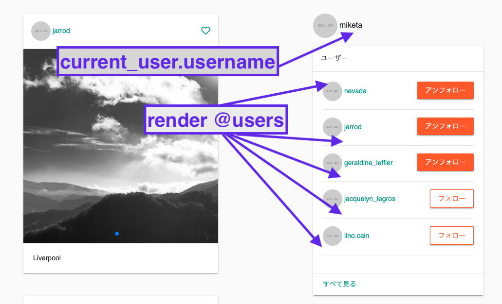
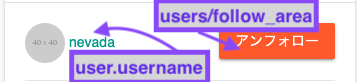
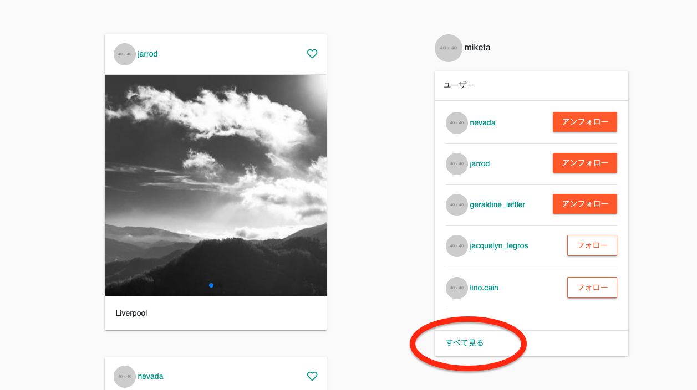
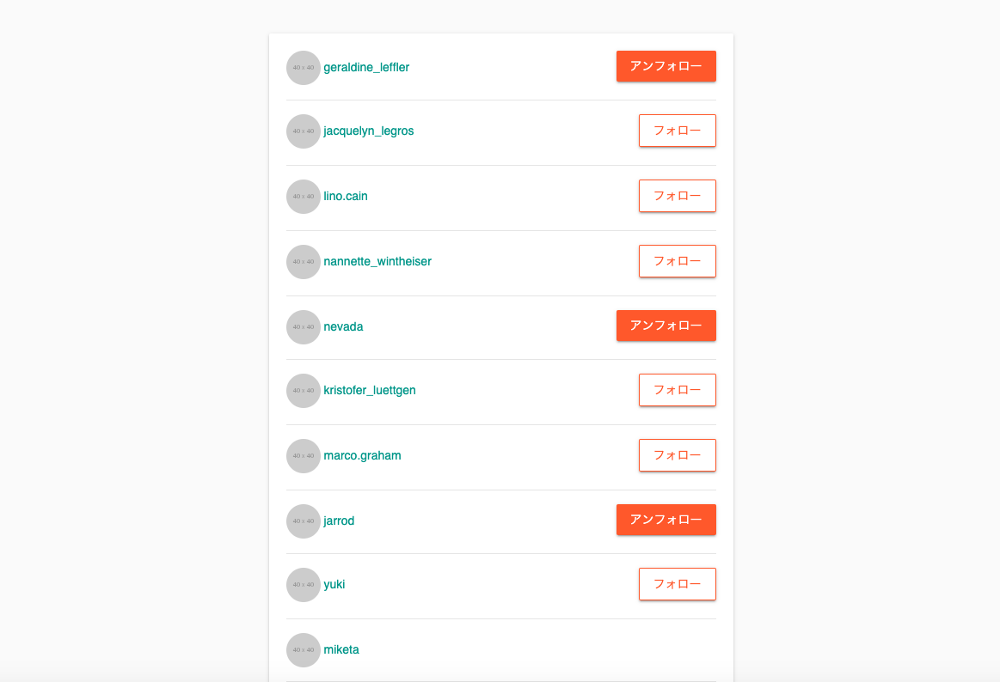

# フォロー機能の実装（コードリーディング）

## 1. FollowとUnfollowの関係を示すRelationshipモデルの作成

Relationshipモデルを作成する。  

フォローのリソースを作成・削除できるように、コントローラ + View の作成を行う。  
ついては、以下のコマンドを実行する。  

```text
rails g model relationship follower_id:integer followed_id:integer
rails g controller relationships create destroy
rails db:migrate
```

マイグレーションを実行する前に、データベース上の制約をかける必要があるので、  
マイグレーションファイルを以下のとおり修正する。  

```rb
# (Migration) create_relationships.rb
class CreateRelationships < ActiveRecord::Migration[5.2]
  def change
    create_table :relationships do |t|
      # NULL falseとする
      t.integer :follower_id, null: false
      t.integer :followed_id, null: false

      t.timestamps
    end
    # フォローするユーザー・フォローされるユーザーのidについて、indexを貼る（パフォーマンス向上のため）
    add_index :relationships, :follower_id
    add_index :relationships, :followed_id
    # フォローやアンフォローができないよう、ユニーク制約をつける
    add_index :relationships, [:follower_id, :followed_id], unique: true
  end
end
```

ルーティングについては、下記のとおりとする。  
relationshipsについては、ネストなどはせず、素直にresourcesを書く。  

```rb
# routes.rb
# 該当箇所のみ
resources :relationships, only: %i[create destroy]
```

## 2. Associationの設定

続いて、Associationの設定を行う。  

ここで目指すのは、ユーザーがフォローするユーザーの取得、  
そして、ユーザーをフォローしているユーザーの取得である。  

難しいので整理をしながら理解に努める。  

なお、解説的なものを書いていたらかなり長くなったので、別ファイルとした。  
- [フォロー・アンフォローのアソシエーション](06_issue_note_follow-unfollow_association.md)

## 3. Relationshipモデルにバリデーションをかける

マイグレーションファイルを作成した場合と同様にバリデーションをかける。  

- follower_id及びfollowed_idにNULL制約をかける
- フォローとフォロワーの組み合わせが一意であるようにユニーク制約をかける

```rb
# relationships.rb
class Relationship < ApplicationRecord
  belongs_to :follower, class_name: 'User'
  belongs_to :followed, class_name: 'User'

  # NULL制約
  validates :follower_id, presence: true
  validates :followed_id, presence: true
  # ユニーク制約
  validates :follower_id, uniqueness: { scope: :followed_id }
end
```

## 4. モデルに独自のメソッドを追加する等

Userモデルにて以下のメソッドを追加する。  

- フォローするユーザーを追加をするfollowメソッド
- フォローするユーザーから外すunfollowメソッド
- フォローしているユーザーであるか確認するfollowing?メソッド
- フォローしているユーザーだけを取得するfeedメソッド

```rb
# user.rb
# 追加するメソッドだけ記載

  def follow(other_user)
    following << other_user
  end

  def unfollow(other_user)
    following.destroy(other_user)
  end

  def following?(other_user)
    following.include?(other_user)
  end

  def feed
    Post.where(user_id: following_ids << id)
  end
  ```

また、投稿の一覧画面にユーザーを表示させる場合、全員を表示させると長くなってしまう。  
順番についても、作成された順番に並べたいので、scopeを以下のように指定する。  

```rb
# user.rb
# scopeに関係する部分のみ
# https://qiita.com/ngron/items/14a39ce62c9d30bf3ac3
  scope :recent, ->(count) { order(created_at: :desc).limit(count) }
```

他、unfollowをした場合、follower_idだけでなく、followed_idも合わせて  
組み合わせとして削除する必要があるので、`active_relationships`及び  
`passive_relationships`のどちらに対しても、`dependenet: :destroy`のオプションを付与する。  

## 5. 投稿一覧において最新のユーザーを５件表示させる

まず、投稿一覧において最新のユーザーを５件表示させる実装から始める。  
最新の５件とするため、コントローラからviewに引き渡す`@users`を下記のとおりとする。  

```rb
# posts_controller.rb
# indexアクションからビューに引き渡すインスタンス変数

@users = User.recent(5)
```

さて、`@users`は`posts/index`に引き渡されるが、  
そこで描画される最新のユーザー５件の表示画面は下記のとおりとなる。  

<br>  

以上のとおり、ログインしている場合、`current_user.username`が表示される。  
そして、各ユーザー部分については、`_user.html.slim`がrenderされる。  

コードについては、下記のとおりとなっている。  
`.col-md-4.col-12`を参照すること。  

```slim
/ posts/index.html.slim
.container
  .row
    / 今回の実装には関係ない箇所
    .col-md-8.col-12
      - if @posts.present?
        = render @posts
      - else
        .text-center.font-weight-bold
          | 投稿がありません
      = paginate @posts

    / 今回の実装に関係してくる箇所  
    .col-md-4.col-12
      - if logged_in?
        .profile-box.mb-3
          = image_tag 'profile-placeholder.png', size: '50x50', class: 'rounded-circle mr-1'
          = current_user.username
      .users-box
        .card
          .card-header
            | ユーザー
          .card-body
            = render @users
          .card-footer
            = link_to 'すべて見る', users_path
```

`_user.html.slim`部分については、下記のとおりである。  

<br>  

また、コードは下記のとおりである。  

```slim
/ users/_user.html.slim
.user.mb-3.d-flex.justify-content-between
  = link_to user_path(user) do
    = image_tag 'profile-placeholder.png', size: '40x40', class: 'rounded-circle mr-1'
    = user.username
  = render 'users/follow_area', user: user
hr
```

パーシャルがまた出てくるが、`users/follow_area`を読み込む形となっている。  

```slim
/ users/_follow_area.html.slim
/ ログインしており、かつ、そのログインユーザーでなければ
- if logged_in? && current_user.id != user.id
  div id="follow-area-#{user.id}"
    / ログインしているユーザーがフォローしていれば
    - if current_user.following?(user)
      = render 'users/unfollow', user: user
    / ログインしているユーザーがフォローしていなければ
    - else
      = render 'users/follow', user: user
```

フォローしているユーザーであれば、アンフォローの操作を可能する画面を表示する。  
逆にまだフォローしていないユーザーであれば、フォローの操作を可能にする画面を表示する。  

```slim
/ users/_unfollow.html.slim

/ 該当ユーザーのidをfollowed_idの引数とする
/ ログインしているユーザーがフォローしているユーザーの中(Relationshipモデルの中）から探す
/ destroyアクションにアクセスするにはrelationshipのidが必要になる
/ Relationshipモデルから適切なデータをparamsとして渡すとよい
= link_to relationship_path(current_user.active_relationships.find_by(followed_id: user.id)), class: 'btn btn-warning btn-raised', method: :delete, remote: true do
  | アンフォロー
```

```slim
/ users/_follow.html.slim

/ 該当ユーザーのidをfollowed_idの引数とする
= link_to relationships_path(followed_id: user.id), class: 'btn btn-raised btn-outline-warning', method: :post, remote: true do
  | フォロー
```

ここから、非同期で処理を実装するため、`relationships#create`もしくは  
`relationships#destroy`のアクションにアクセスし、以下の処理を実行する。  

- DB上のデータをcreateもしくはdestroyする
- 該当ボタンをもう一方のものに変更する処理を実行する

```rb
# relationships_controller.rb
class RelationshipsController < ApplicationController
  before_action :require_login, only: %i[create destroy]

  def create
    @user = User.find(params[:followed_id])
    current_user.follow(@user)
  end

  def destroy
    @user = Relationship.find(params[:id]).followed
    current_user.unfollow(@user)
  end
end
```

```slim
/ create.js.slim
| $('#follow-area-#{@user.id}').html("#{j render('users/unfollow', user: @user)}")

/ destroy.js.slim
| $('#follow-area-#{@user.id}').html("#{j render('users/follow', user: @user)}")
```

## 6. ユーザーの詳細画面作成

続いて、ユーザーの詳細画面を作成する。  
再掲するが、`_user.html.slim`部分については、下記のとおりである。  

<br>  

コードは下記のとおりである。  
引数をuserとしており、`user_path`(show.html.slim)にアクセスする。  

```slim
/ users/_user.html.slim
.user.mb-3.d-flex.justify-content-between
  = link_to user_path(user) do
    = image_tag 'profile-placeholder.png', size: '40x40', class: 'rounded-circle mr-1'
    = user.username
  = render 'users/follow_area', user: user
hr
```

usersコントローラについては、一般的な形になる。  
該当のUserのインスタンスを作成し、`show.html.slim`で表示させればよい。  

```rb
# users_controller.rb
def show
  @user = User.find(params[:id])
end
```

`routes.rb`にて、ユーザーの一覧及び詳細を表示させるためのアクションを用意していなかったため、  
ここで以下のとおりルーティングを変更する。  

```rb:routes.rb
# 該当箇所のみ
# indexとshowアクションを追加する
resources :users, only: %i[index new create show]
```

なお、`show.html.slim`は下記のとおりとなる。  

`follow_area`の中身については、`index.html.slim`と同一であるため省略するが、  
フォローしている場合はアンフォローするボタンを表示し、フォローしていない場合は  
フォローするボタンを表示するようなコードとなる。  

```slim
/ users/show.html.slim
.container
  .row
    .col-md-6.offset-md-3
      .card
        .card-body
          .text-center.mb-3
            = image_tag 'profile-placeholder.png', size: '100x100', class: 'rounded-circle mr-1'
          .profile.text-center.mb-3
            = @user.username
          .text-center
            = render 'follow_area', user: @user
```

## 7. ユーザーの一覧画面の作成

ユーザーの一覧画面の実装を行う。  

投稿一覧画面の右側において表示される最新の５件のユーザーの画面部分の  
下部をクリックすると、こちらにアクセスできるような形とする。  

<br>  

基本的な内容は、投稿一覧画面において表示されるものと同一であるが、  
こちらにおいては表示件数に制限をかけない。  

<br>  

コードについては、下記のとおりとなる。  

```slim
/ users/index.html.slim
.container
  .row
    .col-md-6.col-12.offset-md-3.mb-3
      .card
        .card-body
          = render @users
    .col-md-6.col-12.offset-md-3
      = paginate @users
```

`users#index`アクションに引き渡す@postsであるが、下記のとおりとなる。  
全てのユーザーについて、作成順に並べる。  

また、長くなり過ぎる可能性もあるので、ページネーションを活用する。  

```rb
# users_controller.rb
# 該当アクションのみ表示
def index
  @users = User.all.page(params[:page]).order(created_at: :desc)
end
```

## 8. 投稿の一覧画面で表示するのはフォローしているものだけ（その他の実装も）

最後に、投稿一覧画面において表示させる投稿について、制限を加える。  

ログインしている場合、フォローしているユーザーの投稿のみ表示し、  
ログインしていない場合、全ての投稿を表示させる。  

また、該当の投稿がない場合、「投稿がありません」と表示させる。  
再掲になるが、`posts/index.html.slim`のコードを貼付する。  

```slim
/ posts/index.html.slim
.container
  .row
    / 今回の実装を行う部分
    .col-md-8.col-12
      - if @posts.present?
        = render @posts
      - else
        .text-center.font-weight-bold
          | 投稿がありません
      = paginate @posts

    / 以降、既に実装を終えた最新のユーザー５件の表示に関係する部分  
```

`posts_controller`であるが、下記のとおりとする。  
ログインしている場合とログインしていない場合に分けて、if文を使って分岐させる。  

```rb
# posts_controller.rb
# indexアクションのみ記載
  def index
    @posts = if current_user
               # user.rbにて定義したfeedメソッドを活用する
               # feedメソッド #=> Post.where(user_id: following_ids << id)
               # ページネーションを使う。また、作成順に並べる。
               current_user.feed.includes(:user).page(params[:page]).order(created_at: :desc)
             else
               Post.all.includes(:user).page(params[:page]).order(created_at: :desc)
             end
    # 以降については、既に実装した部分
    @users = User.recent(5)
  end
```  

なお、`_post.html.slim`であるが、下記のとおりである。  

基本的には変更は不要だが、`users/show.html.slim`を作成したので、  
user_pathへのリンクを貼付する。  

```slim
/ _post.html.slim

.card.mb-5.post
  .card-header
    .d-flex.align-items-center
      = link_to user_path(post.user) do
        = image_tag 'profile-placeholder.png', size: '40x40', class: 'rounded-circle mr-1'
        = post.user.username

〜 以下、省略 〜
```
