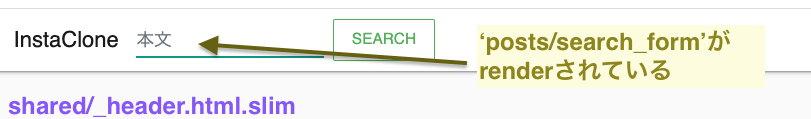

# Issue07 投稿の検索機能の実装

## どんな感じ？

フォローしていない人の投稿を含めて検索できる  
<a href="https://gyazo.com/0ecf1fca07bdcf7707a312b7f312b53e"></a></a><br>  

## 求められている機能実装・実装条件についてについて

- 全ての投稿を検索対象とする（フィードに対する検索ではない）
- 検索条件としては「投稿のbodyに検索ワードが含まれている投稿」とする
- ransackなどの検索用のGemは使わず、フォームオブジェクト、ActiveModelを使って実装すること
  - だいそんさんに確認の上、フォームオブジェクトとActiveModelを使わないこととした
  - [TechEssentialsでした質問](https://tech-essentials.work/questions/94)
- 検索時のパスは`/posts/search`とすること

## 分からない単語・概念等の一覧

- フォームオブジェクト
- ActiveModel

## フォームオブジェクト（ActiveModelはさらっと触れる程度）

だいそんさんのコードでは、以下のようなフォームオブジェクトが使われている。  

```rb
# ここだけ見ても意味不明だと思うが、イメージが湧くように記載  
# include 〜と書いて、attributeも書くところがポイント
# includeすることにより、ActiveModel::ModelとActiveModel::Attributesが使える
# includeしているものはモジュールと言う
# これにより、モデルっぽいものが作れる

class SearchPostsForm
  include ActiveModel::Model
  include ActiveModel::Attributes

  attribute :body, :string
  attribute :comment_body, :string

  def search
    scope = Post.distinct
    scope = scope.body_contain(body) if body.present?
    scope
  end
end
```

今回の検索フォームは投稿本文のみを対象として検索をかけるシンプルなものであったため、  
結果としてフォームオブジェクトの実装は見送ることとした。  

検討後、だいそんさんに質問をした。  
その内容は以下から確認できる。  

- [TechEssentialsでした質問](https://tech-essentials.work/questions/94)

フォームの理解を深めるには、以下の記事を参考にするとよい。  

- [form objectを使ってみよう \- メドピア開発者ブログ](https://tech.medpeer.co.jp/entry/2017/05/09/070758)  
- [Railsで複数モデルを扱うフォームをすっきり書く（Formオブジェクト） \- LiBz Tech Blog](https://tech.libinc.co.jp/entry/2019/04/05/113000#:~:text=Form%E3%82%AA%E3%83%96%E3%82%B8%E3%82%A7%E3%82%AF%E3%83%88%E3%81%A8%E3%81%AF,%E5%B1%A4%E3%81%AE%E7%96%91%E4%BC%BCActiveRecord%E3%80%8D%E3%81%A7%E3%81%99%E3%80%82&text=form_with%E3%81%AEmodel%E3%82%AA%E3%83%97%E3%82%B7%E3%83%A7%E3%83%B3%E3%81%AB,form%20object%E3%81%A8%E5%91%BC%E3%81%B3%E3%81%BE%E3%81%99%E3%80%82)
- [【Rails】FormObjectを使ってほしい \- Qiita](https://qiita.com/9ro/items/10e3676741e09ffb98bb)
- [accepts\_nested\_attributes\_forを使わず、複数の子レコードを保存する \| Money Forward Engineers' Blog](https://moneyforward.com/engineers_blog/2018/12/15/formobject/)  
- [Form Object という選択肢を検討してみる \|](https://www.fundely.co.jp/blog/tech/2020/04/08/180009/)  

メドピア開発者の方のブログを引用するが、フォームオブジェクトは以下のような場合に活用できる。  

> **form object って何？**  
> form_withのmodelオプションにActive Record以外のオブジェクトを渡すデザインパターンです。  
> form_withのmodelオプションに渡すオブジェクト自体もform objectと呼びます。  
>
> 利点は大きく次の2点です。  
>
> 1. DBを使わないフォームでも、Active Recordを利用した場合と同じお作法を利用できるので可読性が増す
> 2. 他の箇所に分散されがちなロジックをform object内に集めることができ、凝集度を高められる  

以上のとおり、フォームオブジェクトの活用の場面はいくつか想定できるが、  
投稿の本文とコメント文に対して合わせて検索をかけるような場合には、実装してもよいかもしれない。  

その場合、以下の記事が参考になると思われる。  

- [【Rails】Formオブジェクトで検索フォームをつくる \| Tech Diary](https://toshiki-tsuji.com/%E3%80%90rails%E3%80%91form%E3%82%AA%E3%83%96%E3%82%B8%E3%82%A7%E3%82%AF%E3%83%88%E3%81%A7%E6%A4%9C%E7%B4%A2%E3%83%95%E3%82%A9%E3%83%BC%E3%83%A0%E3%82%92%E3%81%A4%E3%81%8F%E3%82%8B)

なお、フォームオブジェクトを使わずとも実装は可能である。  
その場合、このteratailの質問をベースにして考えるとよさそう。  
（ただ、controllerに検索メソッドを書いているので、そのまま採用にするには問題がありそうだけど）  

- [Ruby \- railsでポストのタイトル検索＆コメント検索がしたい｜teratail](https://teratail.com/questions/250320)  

複数のモデルに跨がるような場合、もしくはそもそもDBに保存しないのでモデルがない場合、  
フォームオブジェクトを使うと、ActiveModelの特性をincludeすることでモデルっぽいものを作ることができる。  

モデルっぽいものを作ることで、複数のモデルに跨がるものを一つにまとめたり、  
ActiveModelが持つメソッドを使ってコードを簡潔にできるので、そのような利点が生かせそうな場合、  
フォームオブジェクトに使用を積極的に検討してみるとよいだろう。  
（ただ、個人開発レベルだとなかなかお世話になることはないかも。。。）  

## 具体的な実装手順について

以下にて、実装手順を記載する。  

なお、これまではお手本とするファイルのコードリーディングを行うことが多かったが、  
今回はお手本とするファイルと異なり、フォームオブジェクトの実装を行わないため、  
かなりお手本との解離が発生してくる。（よくない書き方等があるかも）  

## 検索用のビュー実装

まず、今回作成するビューの該当箇所を確認する。  

<br>  

まず、ヘッダー部分に該当するが、以下のようになっている。  

```slim
/ shared/_header.html.slim
/ このファイルは、application.html.slimからrenderされている

nav.navbar.navbar-expand-lg.navbar-light.bg-white
  = link_to 'InstaClone', root_path, class: 'navbar-brand'
  button.navbar-toggler aria-controls="navbarTogglerDemo02" aria-expanded="false" aria-label=("Toggle navigation") data-target="#navbarTogglerDemo02" data-toggle="collapse" type="button"
    span.navbar-toggler-icon
  #navbarTogglerDemo02.collapse.navbar-collapse
    / 検索フォーム
    = render 'posts/search_form', search_form: @search_form

    / 以下、今回の実装に無関係なので省略
```

```slim
/ posts/_search_form.html.slim
/ このファイルは、shared/_header.html.slimからrenderされている
/ だいそんさんのコードでは、model: search_form というオプションもあったが不要だと思われたので削除

= form_with url: search_posts_path, method: :get, scope: :q, class: 'form-inline my-2 my-lg-0 mr-auto', local: true do |f|
  = f.search_field :body, class: 'form-control mr-sm-2', placeholder: '本文'
  = f.submit 'Search', class: 'btn btn-outline-success my-2 my-sm-0'
```

ここで`form_with`のオプションが出てくるので、改めて`form_with`について確認する。  

- [Rails 5\.1〜6: 'form\_with' APIドキュメント完全翻訳｜TechRacho（テックラッチョ）〜エンジニアの「？」を「！」に〜｜BPS株式会社](https://techracho.bpsinc.jp/hachi8833/2017_05_01/39502)  
- [Railsのモデルのscopeを理解しよう \- Qiita](https://qiita.com/ozin/items/24d1b220a002004a6351)  
- [form\_with scope \- Qiita](https://qiita.com/akilax/items/f36b13f377f7e442bc73)  

生成されるHTMLコードは以下のとおりである。  
HTMLと照合すれば、どこがどのようなコードを生成している役割を果たしているか理解できる。  

```html
<form class="form-inline my-2 my-lg-0 mr-auto" action="/posts/search" accept-charset="UTF-8" method="get">
  <input name="utf8" type="hidden" value="✓">
  <input class="form-control mr-sm-2" placeholder="本文" type="search" name="q[body]" id="q_body">
  <input type="submit" name="commit" value="Search" class="btn btn-outline-success my-2 my-sm-0" data-disable-with="Search">
</form>
```

ここでフォームからパラメータを送ると、指定したとおり`url: search_posts_path, method: :get`に飛ぶ。  

## collectionを使ったルーティングの設定

次に、検索用のルーティングを設定する。  
collectionについては、Railsガイドに書いてあるとおりである。  

- [Rails のルーティング \- Railsガイド](https://railsguides.jp/routing.html#%E3%82%B3%E3%83%AC%E3%82%AF%E3%82%B7%E3%83%A7%E3%83%B3%E3%83%AB%E3%83%BC%E3%83%86%E3%82%A3%E3%83%B3%E3%82%B0%E3%82%92%E8%BF%BD%E5%8A%A0%E3%81%99%E3%82%8B)  

なお、collectionに似たものとして、memberというものがある。  
memberは、特定のidに対するデータに対するアクションを追加する場合に使用し、  
collectionは、データ全体に対するデータに対するアクションを追加する場合に使用する。  

```rb
# member: 1のデータに対して使用する
http://$(DNS)/users/1/follow

# collection: usersデータ全体に対して使用する
http://$(DNS)/users/search
```

詳細については、以下を参照すること。  

- [【Ruby on Rails】ルーティング member と collection の違い \- きゃまなかのブログ](https://techblog.kyamanak.com/entry/2017/08/12/155914)  

例えば、今回の場合は全体の投稿の中から検索を実行するが、  
もし仮に該当の投稿の中から検索する機能を実装したい場合は、  
memberを使う方が適切である。  

```rb
# routes.rb
Rails.application.routes.draw do
  # 該当部分のみ抜粋
  resources :posts do
    # RESTfulな７つのアクションに対して、searchという８つ目のアクションを追加する
    # collectionは、リソース全体に対して追加するアクション（生成されるURLは、posts/search）
    # memberは、特定のリソースに対して追加するアクション（生成されるURLは、post/:id/search）
    get :search, on: :collection
    resources :comments, shallow: true
  end
end
```

## Postモデルでのscopeの設定

続いて、Postモデルにおいて、検索用にスコープを設定する。  
この設定により、コントローラ側で検索メソッドを書く必要がなくなる。  

```rb
scope :body_contain, ->(word) { where('body LIKE ?', "%#{word}%") }
```

この書き方を見たときに、Rubyの勉強不足だったので「`->`ってなんだっけ？」と思った。  
ハッシュロケットのようにも思えたが、ハッシュロケットは`=>`なので違う。  

以下の記事において細かく解説しているので参考になったが、`->`はラムダというらしい。  
ラムダがあることで、手続きオブジェクトになるらしい。  

- [Ruby初心者 AcriveRecordのscope定義式の意味を理解する \- Javaエンジニア、React\+Redux\+Firebaseでアプリを作る](http://yucatio.hatenablog.com/entry/2016/05/30/084046)  

ただ、手続きオブジェクトというのも分からないので、改めて調べてみた。  
（とはいえ、奥が深いところになるので、改めてチェリー本で勉強をしたい）  

- [手続きオブジェクトの挙動の詳細 \(Ruby 2\.7\.0 リファレンスマニュアル\)](https://docs.ruby-lang.org/ja/latest/doc/spec=2flambda_proc.html)  
- [プログラミング入門　\- Rubyを使って \-, by Chris Pine, 日本語ver\. by S\. Nishiyama](http://www.ie.u-ryukyu.ac.jp/~kono/software/s04/tutorial/Chapter=10.html)  

すると、先ほどのscopeは以下のような意味になることが分かった。  

```rb
# [概要] Post.body_contain(だいそん)と書くと、投稿のbodyカラムに「だいそん」が含まれる投稿を検索してくれる
# [->とは] このマークはラムダであり、メソッドをオブジェクト化するものらしい（後ほどチェリー本できちんと勉強したい）
# [？の意味] クエスチョンマークはプレースホルダーというらしく、SQLインジェクトション対策で使うらしい（？を使わない直書きはNG）
scope :body_contain, ->(word) { where('body LIKE ?', "%#{word}%") }
```

また、以下においては書き方の事例がいくつか出てくるので、参考にした。  

[ActiveRecord::Scoping::Named::ClassMethods](https://api.rubyonrails.org/classes/ActiveRecord/Scoping/Named/ClassMethods.html#method-i-scope)  

## searchアクションを実装（posts_controller.rbに追記）

scopeの設定を終えたので、パラメータから必要な値を取得し、  
検索結果のビューに引き渡すsearchアクションを実装する。  

```rb
  # posts_controller.rb
  # 該当部分のみ記載

  # 検索結果を表示させるアクション
  # body_containメソッドはPostモデルにてscopeを定義した
  def search
    @posts = Post.body_contain(search_post_params[:body]).includes(:user).page(params[:page])
  end

  private

  def search_post_params
    # params.fetch(:q, {})はparams[:q]が空の場合{}を、params[:q]が空でない場合はparams[:q]を返してくれる
    params.fetch(:q, {}).permit(:body)
  end
```

概要について理解していく。

まず、フォームからサーバーに飛ぶparamsであるが、以下のとおりである。  
（なお、ここでは「the」が含まれる投稿を検索していると仮定する）  

```rb
# 「the」は、params[:q][:body]で値を取り出すことができる
<ActionController::Parameters {"utf8"=>"✓", "q"=>{"body"=>"the"}, "commit"=>"Search", "controller"=>"posts", "action"=>"search"} permitted: false>
```

また、search_post_paramsの返り値は以下のとおりである。  
fetchメソッドを使い、必要な部分だけ取り出している。  

```rb
 <ActionController::Parameters {"body"=>"the"} permitted: false>
```

次に、Post.body_contain(search_post_params[:body])を確認する。  
確認する際には、sqlやexplainメソッドを活用するとよい。  

explainメソッドを活用すると、以下のようなSQLが走っていることが分かる。  

```sql
SELECT `posts`.* FROM `posts` WHERE (body LIKE '%the%')
```

以上のようなSQLを走らせて該当のpostsを取得して、検索結果表示ページへと引き渡す。  

なお、N+1問題解消のため、includesメソッドを活用している。  
また、ページネーション実装のため、pageメソッドを活用している。  

## 検索結果のビュー実装

検索結果のビューファイルは、以下のとおりである。  
検索件数と該当の投稿を表示させるものになる。  

```rb
.container
  .row
    .col-md-8.col-12.offset-md-2
      h2.text-center
        | 検索結果: #{@posts.total_count}件
      = render @posts
      = paginate @posts
```

## 検索ワードがフォームに残すための実装

これまでの実装では、検索ワードがフォームに残らなかったため、  
以下のとおり、`application_controller.rb`にてparamsを取得し、  
検索ワードをsearch_fieldのvalueに引き渡すよう設定した。  

- [[fix] 検索ワードがフォームに残るように実装（07 投稿の検索機能の実装）· Pull Request \#7](https://github.com/miketa-webprgr/instagram_clone/pull/7/commits/f473cb0ac8962581ffbcaf4ed034b20eb482a42d)  
