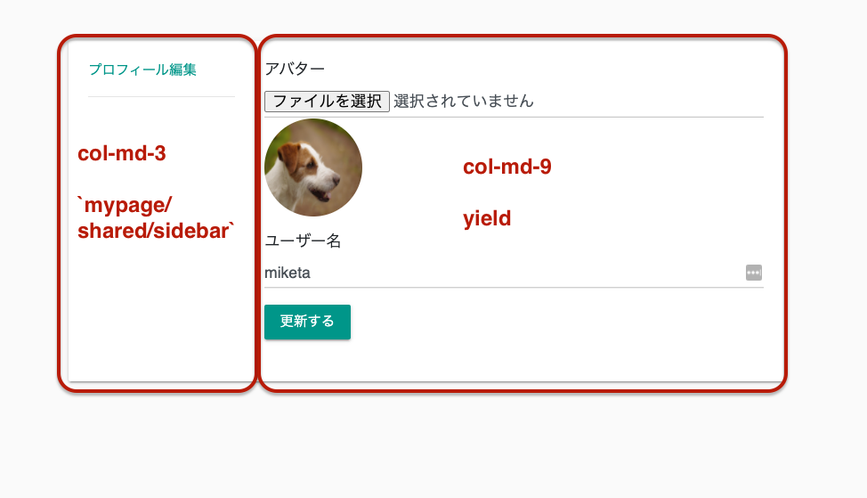

# Issue08 プロフィール編集機能の実装

## どんな感じ？

アバターとユーザー名を変更できるよう、編集用画面を作成する。  

<a href="https://gyazo.com/0ecf1fca07bdcf7707a312b7f312b53e"></a></a><br>  

アバター選択時（ファイル選択時）にプレビューを表示する。  

<a href="https://gyazo.com/0ecf1fca07bdcf7707a312b7f312b53e"></a></a><br>  

更新すると、アバターとユーザー名が変更される。

<a href="https://gyazo.com/0ecf1fca07bdcf7707a312b7f312b53e"></a></a><br>  

## 求められている機能実装・実装条件について

既にgifにて表示したとおり、以下を条件として実装する。  

- 編集画面は/mypage/account/editというパスとする
- アバターとユーザー名を変更できるようにする
- アバター選択時（ファイル選択時）にプレビューを表示する
- image_magickを使用して、画像は横幅or縦幅が最大400pxとなるようにリサイズする
  - image_magickとmini_magickの関係性について不明だったが、どうやらmini_magickはimage_magickを使うためのgemであるらしい
  - ざっと見た限り、だいそんさんのコードではmini_magickについて設定するのを忘れているようだったが、難しくはなさそうなので挑戦したい
- 自分のプロフィール画面の場合、編集画面へのボタンを表示し、アクセスできるようにする
- 以降の課題でもマイページに諸々追加するのでそれを考慮した設計とする（ルーティングやコントローラやレイアウトファイルなど）

## コードリーディング

以下では、コードリーディングを行っていく。  

## Avatar画像を取り扱うための実装

### データベース上での設定

まず、アバター画像を取り扱えるようにするため、usersテーブルにavatarというカラムを追加する。  

```text
rails g migration AddAvatarToUsers avatar:string
```

Issue02の復習になるが、保存するのはあくまでファイル名になるので、  
データ型はStringとなる。このファイル名を活用して、サーバーの保存されている画像のリンクをCarrierwaveで生成させる。  

マイグレーションファイルを実行後、データベース上にカラムが追加され、スキーマファイルが更新させる。  

```rb
# usersテーブルにavatarカラムを追加するマイグレーションファイル

class AddAvatarToUsers < ActiveRecord::Migration[5.2]
  def change
    add_column :users, :avatar, :string
  end
end
```

### Carrierwave上での設定

続いて、Carrierwaveを使うため、設定を行なっていく。  
基本的には公式のGitHubページを参照すればよい。  

- [carrierwaveuploader/carrierwave: Classier solution for file uploads for Rails, Sinatra and other Ruby web frameworks](https://github.com/carrierwaveuploader/carrierwave#getting-started)

また、以前に作成したノートがあるので、そちらを改めて参照するとよい。  

- [TIL/02\_issue\_note\_carrierwave\.md at master · miketa\-webprgr/TIL](https://github.com/miketa-webprgr/TIL/blob/master/11_Rails_Intensive_Training/02_issue_note_carrierwave.md)

設定手順は以下のとおりである。  
なお、MiniMagickを使う場合、HomebrewなどでImageMagickをインストールする必要がある。  

1. `rails generate uploader Avatar`を実行する
2. app/uploaders/avatar_uploader.rbが作成される
3. avatar_uploader.rbの設定を行う（基本的には、コメントアウトを戻す・修正する形で行える）
4. Carrierwaveが使えるように、User.rbファイルに追記を行う

```rb
class AvatarUploader < CarrierWave::Uploader::Base
  # Include RMagick or MiniMagick support:
  # include CarrierWave::RMagick
  # リサイズなどを行うにあたって、公式も推奨しているMiniMagickを採用
  # 使う場合はImageMagickをHomebrewなどでインストールする必要がある
  include CarrierWave::MiniMagick

  # Choose what kind of storage to use for this uploader:
  storage :file
  # fogはS3などのクラウドに画像を保存する場合に必要
  # storage :fog

  # 画像の保存先の設定
  # Override the directory where uploaded files will be stored.
  # This is a sensible default for uploaders that are meant to be mounted:
  def store_dir
    "uploads/#{model.class.to_s.underscore}/#{mounted_as}/#{model.id}"
  end

  # ファイルがアップロードされていない場合、デフォルトの画像を使用するよう設定できる。
  # Provide a default URL as a default if there hasn't been a file uploaded:
  def default_url
    'profile-placeholder.png'
  end

  # アップロードする過程でファイルをリサイズしてくれる
  # Process files as they are uploaded:
  # process scale: [200, 300]
  # こちらを参考にした
  # [CarrierWave\+MiniMagickで使う、画像リサイズのメソッド \- Qiita](https://qiita.com/wann/items/c6d4c3f17b97bb33936f)
  # 縦と横の幅を最大400pxとする。なお、他にもresize_to_sizeなどがある。
  process resize_to_limit: [400, 400]

  # サムネ用のファイルもアップロードする場合、設定を行う
  # Create different versions of your uploaded files:
  # version :thumb do
  #   process resize_to_fit: [50, 50]
  # end

  # アップロードできるファイルの拡張子を制限する
  # Add a white list of extensions which are allowed to be uploaded.
  # For images you might use something like this:
  def extension_whitelist
    %w(jpg jpeg gif png)
  end

  # Override the filename of the uploaded files:
  # Avoid using model.id or version_name here, see uploader/store.rb for details.
  # def filename
  #   "something.jpg" if original_filename
  # end
end
```

```rb
# User.rb
# 追記部分のみ記載

class User < ApplicationRecord
  mount_uploader :avatar, AvatarUploader
  〜 その他は省略 〜
end
```

## ルーティングの設定を行う

以下のとおり、プロフィール編集用のルーティングを設定している。  
ここでは、namespaceを使っている。  

```rb
namespace :mypage do
  resource :account, only: %i[edit update]
end
```

namespaceについては、以前にだいそんさんから解説があった。  
一般的には、管理者画面などを実装する際に使うことが多い。  

- [TIL/20200628\_dyson\_answers\.md at master · miketa\-webprgr/TIL](https://github.com/miketa-webprgr/TIL/blob/master/99_etc/20200628_dyson_answers.md)
- [動画講義一覧 \| TechEssentials](https://tech-essentials.work/movies)
  - Rails全般の知識・勉強方法等の24分30秒頃を参照する

`namespace :mypage do`とすると、mypageディレクトリ以下にコントローラファイルや  
ビューファイルが保存されるようになる。

|Controller |View  |
|-----|------|
|<a href="https://gyazo.com/56e6696a01895f5d46a8ffe588c29212"></a>|<a href="https://gyazo.com/1a9824bd4b10558b501c27ff8ffacf88"></a>|  

これにより、ロジックなどを簡単に書くことができるようになる。  

例えば、管理者画面を実装する場合、「管理者であれば〜を表示したい」ということや、  
「管理者であれば〜という機能を実装したい」などということが多いかと思う。  

そのような場合、ディレクトリを分けることなく、if文などを使って対応することもできるが、  
namespaceを使って、ディレクトリを分ける方がスマートである。  

今回も、そのようなケースに該当するので、そのような対応が取られている。  

## mypage/accounts_controller.rbの設定

ルーティングの設定を終えたので、コントローラの設定を行う。  
編集画面しか実装しないので、editアクションとupdateアクションの設定を行えばよい。  

以下のような画面となるので、該当ユーザーのusernameとavatarを操作できればよい。  

<a href="https://gyazo.com/0ecf1fca07bdcf7707a312b7f312b53e"></a></a><br>  

`mypage/accounts_controller.rb`のコードは、以下のとおりとなる。  

```rb
class Mypage::AccountsController < Mypage::BaseController
  def edit
    @user = User.find(current_user.id)
  end

  def update
    @user = User.find(current_user.id)
    if @user.update(account_params)
      redirect_to edit_mypage_account_path, success: 'プロフィールを更新しました'
    else
      flash.now['danger'] = 'プロフィールの更新に失敗しました'
      render :edit
    end
  end

  private

  def account_params
    params.require(:user).permit(:email, :username, :avatar, :avatar_cache)
  end
end
```

なお、updateアクションであるが、`@user = current_user`としてもよさそうだが、  
あえてしないのは、以下の記事のとおりとのこと。  

- [\(Railsで\)プロフィール更新みたいなやつの注意点 \| けんちゃんくんさんのWeb日記](https://diary.shu-cream.net/2014/09/11/tips-for-current-user.html)

ただ、あまり理解できなかったので、TechEssentialsで質問をしてみた。  

- [Issue 09 プロフィール更新の際の注意点について \| TechEssentials](https://tech-essentials.work/questions/119)

なお、paramsの中身は下記のとおりである。  

```rb
<ActionController::Parameters {
  "utf8"=>"✓",
  "_method"=>"patch",
  "authenticity_token"=>"E4ZrhzY3kwtvG38yph9+m6QoNlgdYLTHvAOWeD2jUWVHHD/S5ccaECbgwqlPqwbiDrRE7gm1AyYeNFEa02ei5A==",
  "user"=><ActionController::Parameters {
    "avatar"=>#<ActionDispatch::Http::UploadedFile:0x00007ff770e85bb0
                @tempfile=#<Tempfile:/var/folders/79/zgjvw1r57z71ktv5q1s5c6j40000gn/T/RackMultipart20200819-79877-1rvepos.jpg>,
                @original_filename="20161117_messi2_getty.jpg",
                @content_type="image/jpeg",
                @headers="Content-Disposition: form-data; name=\"user[avatar]\"; filename=\"20161117_messi2_getty.jpg\"\r\nContent-Type: image/jpeg\r\n"
              >,
    "avatar_cache"=>"",
    "username"=>"miketa"
  } permitted: false
>
```

emailについてはまだ取り扱っていないが、今後の実装を視野に入れて、account_paramsに組み込んでいるものと思われる。  

avatar_cacheについては、JSの方にも影響がなかったため、あまりその意義について理解していないが、  
おそらく同様に、今後の実装を視野に入れて組み込んだものと思われる。  

## mypage/base_controller.rbの設定

namespaceを区切ったので、マイページ関係のアクションを実行する際に共通して必要となるコードは、  
`base_controller.rb`にまとめておくとよい。これは、管理者画面実装の際などによく使われるテクニックである。  

```rb
class Mypage::BaseController < ApplicationController
  before_action :require_login
  layout 'mypage'
end
```

## ビューファイルの実装

続いて、プロフィール編集画面に関係する実装を行なっていく。  
まず、application.html.slimファイルに代わって、`layouts/mypage.html.slim`ファイルを用意する。  

namespaceを使ったことで、ビューファイル内で分岐をさせるような形で対応する必要がなくなった。  

```slim
/layouts/mypage.html.slim
/application.html.slimのマイページ版と捉えてよい

doctype html
html
  head
    meta content=("text/html; charset=UTF-8") http-equiv="Content-Type" /
    meta[name="viewport" content="width=device-width, initial-scale=1.0"]
    title マイページ | InstaCloneApp
    = csrf_meta_tags
    = csp_meta_tag
    = stylesheet_link_tag 'mypage', media: 'all'
    = javascript_include_tag 'mypage'
  body
    = render 'shared/header'
    = render 'shared/flash_messages'
    main
      .container
        .row
          .col-md-8.offset-md-2
            .card
              .card-body
                .row
                  .col-md-3
                    = render 'mypage/shared/sidebar'
                  .col-md-9
                    .mypage_content
                      = yield
```

なお、画面構成であるが、以下のとおりとなっている。  

<a href="https://gyazo.com/0ecf1fca07bdcf7707a312b7f312b53e"></a></a><br>  

次に、雛形となる`layouts/mypage.html.slim`ファイルに流し込む、  
`mypage/shared/sidebar`を用意する。  

今後、このサイドバーにプロフィール編集以外のメニューを追加していく。  

```slim
/mypage/shared/_sidebar.html.slim

nav
  ul.list-unstyled
    li
      = link_to 'プロフィール編集', edit_mypage_account_path
      hr
```

続いて、雛形となる`layouts/mypage.html.slim`ファイルのyieldに流し込む、  
`edit.html.slim`を用意する。プロフィール編集画面の核となる部分である。  

```slim
/mypage/accounts/edit.html.slim
/yield部分で読み込まれる

= form_with model: @user, url: mypage_account_path, method: :patch, local: true do |f|
  / なぜ object: @user ではなく、object: f.object となっているのかよく分からない
  = render 'shared/error_messages', object: f.object
  .form-group
    = f.label :avatar
    / onchangeを使うことで、ファイルアップロード後にJSが発火する
    / acceptオプションを使い、画像ファイルのみしか受け付けないよう制限をかける
    = f.file_field :avatar, onchange: 'previewFileWithId(preview)', class: 'form-control', accept: 'image/*'
    / バリデーションエラーが発生してフォームが再表示された場合も、キャッシュを活用してファイルを保持する
    = f.hidden_field :avatar_cache
    = image_tag @user.avatar.url, class: 'rounded-circle', id: 'preview', size: '100x100'
  .form-group
    = f.label :username
    = f.text_field :username, class: 'form-control'
  = f.submit class: 'btn btn-primary btn-raised'
```

残念ながら、`object: f.object`となっている理由が分かっていないので質問してみた。  

- [Issue 09 パーシャルに渡す変数について \| TechEssentials](https://tech-essentials.work/questions/121)

コードを理解するにあたって、以下の記事を参考にした。  

- [f.file-fieldについて --- ActionView::Helpers::FormBuilder](https://api.rubyonrails.org/v5.2.4/classes/ActionView/Helpers/FormBuilder.html#method-i-file_field)
- [【Rails】画像の即時プレビュー機能を実装 \- エンジニアを目指す修行Blog](https://angrooo.hatenablog.com/entry/2020/04/21/144507)
- [【10分でマスター】onChangeでフォームの項目をコントロールしよう \| 侍エンジニア塾ブログ（Samurai Blog） \- プログラミング入門者向けサイト](https://www.sejuku.net/blog/25060)

なお、プレビュー画面を表示させるため、onchangeオプションが使われている。  

## プレビュー機能の実装

ファイルアップロード後に発火されるJSは、以下のとおりとなっている。  

まだよく分かっていないが、JavascriptでFileAPIっていうのを使っているらしい。  
このQiita記事が非常によくまとまっているので、参考にすると良さそう。  

- [JavaScript FileAPIについて学ぶ \- Qiita](https://qiita.com/kodokunadancer/items/8028d87d8d2bc6c00e69)

```js
//assets/javascripts/mypage.js

// 以下にて、必要なJSファイルを読み込む
//= require jquery3
//= require popper
//= require rails-ujs
//= require bootstrap-material-design/dist/js/bootstrap-material-design.js

function previewFileWithId(selector) {
    // 大まかな流れ
    // アップロード機能を担うinputタグを取得 → そのタグからアップロードしたファイルを取得
    // そのファイルを読み込み、読み込み終わった後に元のアバターと差し替えるイベントを実行する

    // jQueryにevent.targetというものがあり、イベント発生源である要素（h1やpなど）を取得する。
    // 今回の場合、`f.file_field :avatar, onchange: 'previewFileWithId(preview)', class: 'form-control', accept: 'image/*'`の部分のinputタグを取得
    // [https://www.w3schools.com/jquery(event.target)](https://www.w3schools.com/jquery/tryit.asp?filename=tryjquery_event_target)
    const target = this.event.target;

    // filesを使うと、転送中のファイルを取得できる
    // [DataTransfer\.files \- ファイルの一覧 \| DOMリファレンス](https://lab.syncer.jp/Web/API_Interface/Reference/IDL/DataTransfer/files/)
    const file = target.files[0];

    // ファイルを読み込む
    // [FileReader \- Web API \| MDN](https://developer.mozilla.org/ja/docs/Web/API/FileReader)
    const reader  = new FileReader();

    // loadendイベントについて記述したコード（これにより、プレビュー画像が非同期通信にて表示される）
    // loadがendした時に発火する
    // reader.addEventListener("load", function () { selector.src = reader.result;}, false)と書き換えることができる
    // [GlobalEventHandlers\.onloadend \- Web APIs \| MDN](https://developer.mozilla.org/en-US/docs/Web/API/GlobalEventHandlers/onloadend)
    reader.onloadend = function () {
        selector.src = reader.result;
    }

    // 指定されたファイルオブジェクトを読み込むために使用するメソッド
    // 読込処理が終了すると readyState は DONE に変わり、loadend イベントが生じる。
    // それと同時に result プロパティにはファイルのデータを表す、base64 エンコーディングされた data: URL の文字列が格納される。
    // [FileReader\.readAsDataURL\(\) \- Web API \| MDN](https://developer.mozilla.org/ja/docs/Web/API/FileReader/readAsDataURL)
    if (file) {
        reader.readAsDataURL(file);

    // ファイルがない場合、`selector.src`を空にする
    // この部分についてコードの意義がよく分からなかったので、TechEssentialsで質問した
    } else {
        selector.src = "";
    }
}
```

なお、onloadendとして、失敗した場合については、空のアイコンを表示させるようにしている。  

<a href="https://gyazo.com/0ecf1fca07bdcf7707a312b7f312b53e"></a></a><br>  

あまり意義が分からないので、成功した場合のみにイベントを発火するようにコードを変更しても良いのではないか。  
（意図としては、ファイルの読み込みが失敗したことを分かりやすくするため？）

そもそも、失敗する場合というのはどのような場合が想定できるのだろうか。。。  

```js
// ファイルの読み込みが失敗した場合、何も起こらないような設計としてみた

function previewFileWithId(selector) {
    const target = this.event.target;
    const file = target.files[0];
    const reader  = new FileReader();

    reader.onload = function () {
        selector.src = reader.result;
    }
    if (file) {
        reader.readAsDataURL(file);
    }
}
```

## SCSSの設定とプリコンパイルの設定

SCSSについて、プロフィール画面は他と設定を変えると都合がよいので、  
新しく`mypage.scss`を作成し、以下のとおりとする。  

```scss
@import 'bootstrap-material-design/dist/css/bootstrap-material-design.css';
@import 'font-awesome-sprockets';
@import 'font-awesome';

main {
  padding-top: 50px;
}
```

プリコンパイルするには、以下の`config/initializers/assets.rb`を編集する必要がある。  
コメントに書かれているとおり、application.jsなどは設定せずともプリコンパイルの対象となっている。  

よって、今回新しく追加した、`mypage.js`と`mypage.scss`を対象とする。  

憶測で書くが、プリコンパイル前に`mypage.scss`が`mypage.css`に変換されているため、  
`Rails.application.config.assets.precompile += %w( mypage.js mypage.css )`とする。  

```rb
# config/initializers/assets.rb
# 該当箇所のみ記載

# Precompile additional assets.
# application.js, application.css, and all non-JS/CSS in the app/assets
# folder are already added.
Rails.application.config.assets.precompile += %w( mypage.js mypage.css )
```

## 自分のプロフィール画面の場合、編集画面へのリンクを貼る

以下のとおり、自分のプロフィール画面の場合、編集画面へのボタンを表示し、  
編集ページへとアクセスできるよう実装する。  

<a href="https://gyazo.com/0ecf1fca07bdcf7707a312b7f312b53e"></a></a><br>  

コードは、下記のとおりとする。  

```slim
# users/show.html.slim

.container
  .row
    .col-md-10.offset-md-1
      .card
        .card-body
          / ログインしているユーザーのプロフィール画面を開いている場合、プロフィール編集画面へのリンクを表示する
          / ぼっち演算子を使って、ログインしていない場合であっても例外処理が起きないようにする
          / ぼっち演算子は「オブジェクト&.メソッド」という形で使う
          - if current_user&.id == @user.id
            .text-center.mb-3
              = link_to 'プロフィール編集', edit_mypage_account_path, class: 'btn btn-raised btn-warning'
          .text-center.mb-3
            / とりあえずサンプルのアバターを表示していたが、該当のアイコンを表示するよう変更する
            / なお、carrierwaveで設定済のため、アバターの設定が行われていない場合、デフォルトのサンプルアバターが表示される
            = image_tag @user.avatar.url, size: '100x100', class: 'rounded-circle mr-1'
```

## その他

`image_tag 'profile-placeholder.png'`としていた箇所を変更する。  
複数のファイルにまたがるため、検索機能を活用していくとよい。  

```rb
# 以下はあくまで参考例であり、変更内容は各ファイルにおいて微妙に異なる。  

# Before
= image_tag 'profile-placeholder.png', size: '50x50', class: 'rounded-circle'

# After
= image_tag current_user.avatar.url, size: '50x50', class: 'rounded-circle mr-1'
```

また、詳細については記載しないが、indexページの右側に表示されるユーザーの一覧部分において、  
ログインユーザーのアバターとユーザー名が表示される。そちらにも修正を加え、編集画面へのリンクを貼付する。  
（コードについては省略する）。  

そして、`config/locales/ja.yml`にアバターを加えておく。  

```yml
# config/locales/ja.yml

ja:
  activerecord:
    models:
      user: 'ユーザー'
      post: '投稿'
      comment: 'コメント'
    attributes:
      user:
        email: 'メールアドレス'
        password: 'パスワード'
        password_confirmation: 'パスワード確認'
        username: 'ユーザー名'
        avatar: 'アバター'
```
