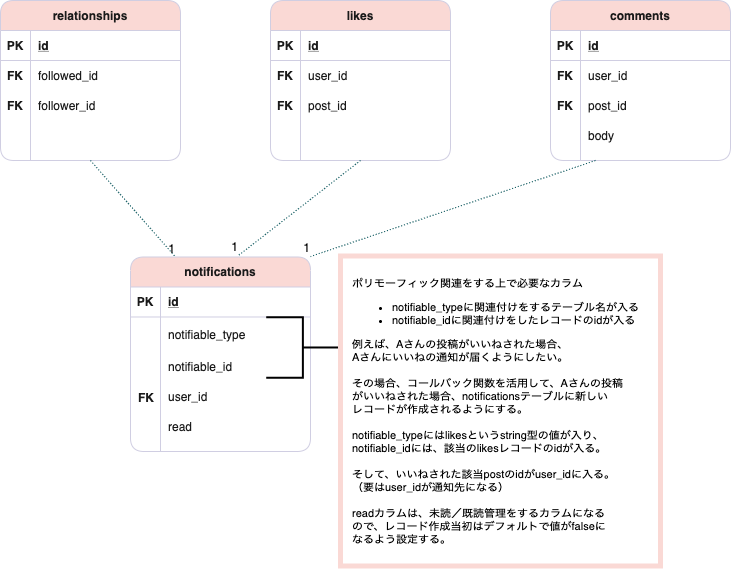

# Issue10 通知機能の実装

## どんな感じ？

フォローされた・いいねされた・コメントがあった場合、そのユーザーに通知が届きます。  
具体的には、右上のハートマークのところに表示されます。  

ハートには、新しい通知の数が表示されます。  
ハートをクリックすると、最新の通知が10件まで表示されます。  

<a href="https://gyazo.com/0ecf1fca07bdcf7707a312b7f312b53e"></a></a><br>  

既読の通知については薄暗い背景、未読の通知については白い背景で表示されます。  
クリックすると、該当のページにアクセスすることができます。  
（なお、各通知をクリックした場合に既読と判定されます。）  

<a href="https://gyazo.com/0ecf1fca07bdcf7707a312b7f312b53e"></a></a><br>  

## 求められている機能実装・実装条件について

- 通知機能を実装してください。
  - ヘッダー部分の通知リストには最新の10件しか表示させないでください。
- ポリモーフィック関連を使ってください。
- タイミングと文言は以下の通りとします。（リンク）と書いてある箇所はリンクを付与してください。
  - フォローされたとき
    - xxx（リンク）があなたをフォローしました
    - 通知そのものに対してはxxxへのリンクを張る
  - 自分の投稿にいいねがあったとき
    - xxx（リンク）があなたの投稿（リンク）にいいねしました
    - 通知そのものに対しては投稿へのリンクを張る
  - 自分の投稿にコメントがあったとき
    - xxx（リンク）があなたの投稿（リンク）にコメント（リンク）しました
    - 通知そのものに対してはコメントへのリンクを張る（厳密には投稿ページに遷移し当該コメント部分にページ内ジャンプするイメージ）
- 既読判定も行ってください。通知一覧において、既読のものは薄暗い背景で、未読のものは白い背景で表示しましょう。
- 既読とするタイミングは各通知そのものをクリックした時とします。
- 不自然ではありますが通知の元となったリソースが削除された際には通知自体も削除する仕様とします。

## 分からない単語・概念等の一覧

- [ポリモーフィック関連とは](10_issue_note_polymorphic.md)

## コードリーディング

基本的にはだいそんさんの作成したアプリをコードリーディングし、  
従来どおり、それに倣う形で実装を行うが、以下の点について違う形で実装する。  

- ActivityモデルをNoitificationモデルとする
- enumを使わず、ダックタイピングを利用する

なお、以上については該当の箇所で詳細を説明していく。  

## ポリモーフィック関連を使った実装方針

ポリモーフィック関連については既に以下のとおりノートでまとめているが、  
ただ、今回のケースにおいて、どのような実装を行えばよいのだろうか。  

- [ポリモーフィック関連とは](10_issue_note_polymorphic.md)

記載のとおり、ポリモーフィック関連とは、複数のモデルに対して共通のモデル紐づけるような場合に使用する。  
今回であれば、フォローされた・いいねされた・コメントがあった場合にユーザーに通知を届けるため、  
`Relationship`・`Like`・`Comment`のモデルに対して、共通のモデルを紐づける。  

だいそんさんのコードにおいて、ポリモーフィック関連とするモデル名は`Activity`とされているが、  
今回追加するのは通知機能であるため、`Notification`モデルを追加することとしたい。  

よって、テーブル設計は下記のとおりとする。  

<br>

なお、ポリモーフィック関連のノート内で既に触れているが、このような関連付けだけでなく、  
中間テーブルを使ったテーブル設計などでも実装可能である。詳細についてはこちらを参照すること。  

- [複数のテーブルに対して多対一で紐づくテーブルの設計アプローチ｜スパイスファクトリー株式会社](https://spice-factory.co.jp/development/has-and-belongs-to-many-table/)

また、だいそんさんのコードにおいては、`action_type`というカラムを設け、こちらを`enumerable`としている。  

```rb
enum action_type: { commented_to_own_post: 0, liked_to_own_post: 1, followed_me: 2 }
```

ただし、この`action_type`の情報については、紐付け先を識別するための`subject_type`カラム  
（こちらのコードにおいては`notifiable_type`カラムに当たるもの）と重複するところがある。  
（例えば、`subject_type`がlikesであれば、必然的に`action_type`は`liked_to_own_post: 1`になる）  

そこで、今回の実装においては、`action_type`に当たるようなカラムは設けない形で、自分なりの実装  
を行ってみたいと思う。だいそんさんのコードにおいては、action_typeの値をrenderするパーシャルのファイル名  
とうまく連携させることで、コードを短く書く工夫をしているが、おそらく違う形でも出来るのではないかと思われる。  

また、モデル間の関連付けについては、Railsガイドを参考にしたい。  

- [Active Record の関連付け \- Railsガイド](https://railsguides.jp/association_basics.html#%E3%83%9D%E3%83%AA%E3%83%A2%E3%83%BC%E3%83%95%E3%82%A3%E3%83%83%E3%82%AF%E9%96%A2%E9%80%A3%E4%BB%98%E3%81%91)

あと、misakiさんが各テーブルの関係性をまとめた図（力作！！！）を作っていたので、参考にした。  

- [10 通知機能の実装 by misaki\-kawaguchi · Pull Request \#12 · misaki\-kawaguchi/insta\_clone](https://github.com/misaki-kawaguchi/insta_clone/pull/12)

## マイグレーションファイルの作成 + `db:migrate`

さて、マイグレーションファイルを作成する。  
既に作成した図があるので、そちらに従う形で実装する。  

また、Railsガイドにおいてマイグレーションファイルの参考例が記載されているので、  
そちらをベースにして作成してみた。  

```rb
rails g model Notification notifiable:references{polymorphic} user:references read:boolean

# マイグレーションファイル作成後に以下を追加
readカラムに`null:false, default:false`を追加
```

すると、以下のようなマイグレーションになる。  

```rb
class CreateNotifications < ActiveRecord::Migration[5.2]
  def change
    create_table :notifications do |t|
      t.references :notifiable, polymorphic: true
      t.references :user、foreign_key: true
      t.boolean :read, null: false, default: false

      t.timestamps
    end
  end
end
```

なお、以下のマイグレーションでも同じようにテーブルを作成することができる。  

```rb
class CreateNotifications < ActiveRecord::Migration[5.2]
  def change
    create_table :notifications do |t|
      t.bigint  :notifiable_id
      t.string  :notifiable_type
      t.references :user
      t.boolean :read, null: false, default: false

      t.timestamps
    end
    add_index :notifications, [:notifiable_type, :notifiable_id]
  end
end
```

`rails db:migrate`を実行すると、以下のようなテーブル構造となる。  

```rb
  create_table "notifications", options: "ENGINE=InnoDB DEFAULT CHARSET=utf8", force: :cascade do |t|
    t.string "notifiable_type"
    t.bigint "notifiable_id"
    t.bigint "user_id"
    t.boolean "read", default: false, null: false
    t.datetime "created_at", null: false
    t.datetime "updated_at", null: false
    t.index ["notifiable_type", "notifiable_id"], name: "index_notifications_on_notifiable_type_and_notifiable_id"
    t.index ["user_id"], name: "index_notifications_on_user_id"
  end
```

## モデルの実装（ポリモーフィックな関連付けを行う）

繰り返しになるが、モデル間の関連付けについては、Railsガイドを参考にしたい。  

- [Active Record の関連付け \- Railsガイド](https://railsguides.jp/association_basics.html#%E3%83%9D%E3%83%AA%E3%83%A2%E3%83%BC%E3%83%95%E3%82%A3%E3%83%83%E3%82%AF%E9%96%A2%E9%80%A3%E4%BB%98%E3%81%91)

すると、以下のようになることが分かる。  

Railsガイドの事例においては`has_many`となっているが、今回の事例においては、  
一つのフォロー登録・いいねアクション・コメント投稿をした際に通知が飛ぶのは１件だけなので、  
`has_many`ではなく、`has_one`を使用した。  

また、「通知の元となったリソースが削除された際には通知自体も削除する仕様とする」とのことだったので、  
`dependent: :destory`を必要な箇所に追記した。  

```rb
class Notification < ApplicationRecord
  belongs_to :notifiable, polymorphic: true
end

class Relationship < ApplicationRecord
  has_one :notification, as: :notifiable, dependent: :destroy
end

class Like < ApplicationRecord
  has_one :notification, as: :notifiable, dependent: :destroy
end

class Comment < ApplicationRecord
  has_one :notification, as: :notifiable, dependent: :destroy
end
```

また、ポリモーフィックな関連付けとは別の話として、NotificationモデルはUserモデルと紐付けを  
する必要がある（通知一覧取得にあたって必要）ので、以下のとおり実装をおこなう。  

```rb
class Notification < ApplicationRecord
  belongs_to :user
end

class User < ApplicationRecord
  has_many :notifications, dependent: :destroy
end
```

## ルーティングの設定

通知一覧を表示させるため、`routes.rb`に以下を追記する。  
以下の記事を見る限り、ルーティングしてネストするのが


indexアクションのみがあればよいため、以下のとおりとする。  
（今後、

- マイグレート
- polymorphicな関連付けを行う
  - 状況を整理する
  - railsガイドを参考にする
  - [Active Record の関連付け \- Railsガイド](https://railsguides.jp/association_basics.html#%E3%83%9D%E3%83%AA%E3%83%A2%E3%83%BC%E3%83%95%E3%82%A3%E3%83%83%E3%82%AF%E9%96%A2%E9%80%A3%E4%BB%98%E3%81%91)
  - [If use enum for polymorphic\_type, polymorphic associations cannot work well · Issue \#17844 · rails/rails](https://github.com/rails/rails/issues/17844)
  - 
