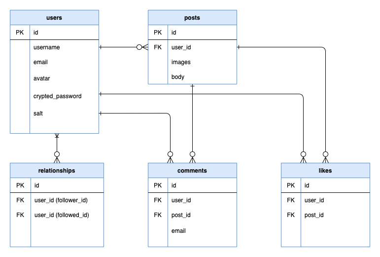

# kudoushinichiroさんの質問（feedメソッドについて）

質問は以下のとおり

- [Rails特訓コース課題６　モデルメソッド\(where文\)について \| TechEssentials](https://tech-essentials.work/questions/135)

## Qiitaでブログを書いちゃった

- [問題です！ ①と②が同じだって分かりますか？（クラス・インスタンス・メソッド・引数を実践で理解しよう！） \- Qiita](https://qiita.com/miketa_webprgr/items/361d339d2739792457ab)

## 解説したいと思ったきっかけ

- もうやったやつだと思ってノートを見返したら、適当に流してしまっていて、理解していないことが判明したから
- 今の自分なら理解できるはずと思ったけど、すぐにはよく分からなかったから
- 初心者殺し的なところがあるので、丁寧に一度解説したと思ったから
- お節介なやつだから
- ドヤりたいから！！！

## 該当箇所

```rb
# posts_controller.rb
# indexアクション

current_user.feed.includes(:user).page(params[:page]).order(created_at: :desc)
```

```rb
# User.rb

def feed
  Post.where(user_id: following_ids << id)
end
```

**以上のようなコードがあるが、このfeedメソッドが何をやっているのかよく分からない！**  

## ER図

<br>

## 解説前に

私も基本的なところしか分かっていないですが、クラス・インスタンス・メソッドの概念は抑えている必要があります。  
私もチェリー本の７章を読みましたが、これはマジで大事です！ 読んだ方がいいと断言できます！！  

ただ、Rails特訓コースに取り組んでいる人なら、何となくは分かっているはず！  
ゆっくりと考えていって、初心者殺し的なところを突破できれば分かる！（と思って、私も書き出しています笑）  

せっかくなので、ブログのネタにしようと思うので、  
今回はあえて何にも知らない人に説明するぐらいの勢いで説明してみます。  

うぜえと思ったら、適宜スルーしてください。  
必要以上に丁寧な箇所もあるかと思うので。  

あと、includes以下についての説明は対象ではないので、ここでは省略します。  

## 分かるようになると

分かるこということは、物事を分解して自分の言葉で言い換えられることです。  
ということで、理解するとこんな感じで書き換えることもできます。  
（こんな書き方したら、めちゃくちゃ怒られると思いますけど笑）  

```rb
# ①と②は同じ

Post.where(user_id: following_ids << id) #=> ①
return Post.where(:user_id => self.following_ids.<<(self.id)) #=> ②
```

むしろ、②の方が分かりやすいのかもしれないと思わなくもないんですが、  
これを①と書けるのがRubyの良さでもあり、悪さでもある・・・って感じらしいです。  

## クラス・インスタンスの概念を把握する

まず、クラスとインスタンスの関係ですが、これは個人的な理解なので、誤った解釈を導く可能性があります。  

ただ、誤解を恐れずに言うと、クラスとは抽象的な概念としての型です。  
他方、インスタンスはその型から縁取られて出てきた具体的な個体です。  

クッキーの型取りする銀色のやつと、実際に型取りされたクッキーの関係に似てますかね笑

例えば、概念として「犬」という言葉を私たちは理解してますけど、その時点で理解している「犬」というのは、  
すごいふわふわしたものです。別に柴犬でもダックスフンドでも犬ですし、同じ柴犬でも大きさが微妙に違います。  
けど、概念としての犬であることには違いないわけで、それを私たちは全て犬として認識しています。  

この認識している概念としての犬こそが、クラスとしての犬です。  
（ここでは便宜的に、犬クラスは犬種と長さという属性を持つクラスだと定義しましょう。）  

ただ、この世界に存在するのは、全て具体的な犬です。  
犬インスタンスです！　犬オブジェクトです！  
（ちなみに、英語が多少できる人なら、インスタンスの意味から覚えるといいかもしれません。  
  インスタンスは、for example と同じ意味の for instance の instance です。  
  クラスの具体例なので、インスタンスって言うんですね！・・・きっと笑）  

犬インスタンスは、属性（attributesというやつです）を持っています。  
犬インスタインス（id:1)は、犬種：柴犬、長さ：1mという属性を持っているかもしれませんが、  
犬インスタンス(id:2)は、犬種：ダックス、長さ：50cmという属性かもしれません。  

## メソッドについて考える

クラスとインスタンスについて把握して上で、メソッドについて考えてみましょう。  
メソッドというのは「できることリスト」みたいなものです。  

ここでは、また便宜的に、犬クラスは「走る」というメソッドを持っていることにしましょう。  

犬クラスというのは、概念的なものなので、走ることはできません。  
走らせるとエラーになります。走れるのは犬インスタンスだけです。  
（User.saveなどと書いてエラーになったとき、犬クラスは走れないことを思い出しましょう）  

逆に犬オブジェクトから、犬種（という属性）が柴犬である犬を探すことはできません。  
柴犬を見つけてきたい場合、犬クラスから探しましょう。  
(@user.whereなどと書いてエラーになったとき、あなたはペットのゴン太という柴犬から、  
  柴犬を探そうとしているなんだか残念な人だという自覚を持ちましょう）  

## `current_user`って何？

かなり冗長に説明しましたが、そろそろ具体的に考えていきましょう。  
まず、`current_user`から考えてみましょう。  

このコードだけ読んでも`current_user`については分からないのですが、  
実はこの`current_user`、sorceryのメソッドです。  

公式GitHubに書いています。  

- [Sorcery/sorcery: Magical Authentication](https://github.com/Sorcery/sorcery)
- [具体的なコードはこちらからどうぞ](https://github.com/Sorcery/sorcery/blob/a02c1247642357129ea739354c22978a06fccaa9/lib/sorcery/controller.rb#L87)

え、メソッドなの！？  
と思われたあなた！ その発想が出てくるのは非常によいと思います！（初学者のくせに偉そう・・・）  

GitHubで辿っていくと分かりますが、sessionの`user_id`を使って、  
Userクラスから該当のユーザーを取得すると書いています。  

なので、まあ結果として、`current_user`は、Userクラスのインスタンスとして考えてほぼ差し支えないんですが、  
正確には`current_user`はメソッドであって、その返り値がUserクラスのインスタンスになるように  
設計されているということを覚えておいてください。  

## `feed`メソッドって何？

`feed`というメソッドですが、Userモデル（Userクラス）に書かれているインスタンスメソッドです。  
インスタンスメソッドなので、userインスタンスのみ実行できます。  

※　ちなみにクラスメソッドというものもありますが、それはチェリー本あたりで勉強してください。  
※　クラスメソッドがあるとすれば、これは概念としてのUserのみしか使えないメソッドになります。

先ほど言ったとおり、`current_user`はメソッドではありますが、そのメソッドを実行した結果として、Userクラスから  
該当のログインユーザーを取得します。（面倒なので、以後このログインユーザーを`current_user`と呼びます）  

なので、`current_user`はuserインスタンスであり、  
Userモデルのインスタンスメソッドである`feed`というメソッドが使えるのです。  

`feed`メソッドは、`Post.where(user_id: following_ids << id)`を実行します。  
そして、返り値を取得します。  

```rb
current_user.feed
#=> ここで、`Post.where(user_id: following_ids << id)`の返り値を取得
```

## `feed`メソッドの中身を見ていく（following_idsとは）

さて、ここで`Post.where(user_id: following_ids << id)`を見ていこうと思います。  

特に見慣れない部分が`following_ids << id`の箇所だと思いますし、私もこれを見て、  
「え、あ、えと、分からない、ごめんなさい」ってなったので、ここが１番のつまづきポイントだと思います。  

もしかしたら、クラスやメソッドの問題というよりも、ここがネックで理解できなかったのかもしれません。  

まず、`following_ids`ですが、これはアソシエーションで`has_many`書くと使えるメソッドです。  
「え、メソッド！」と思ったかもしれませんが、Railsガイドに書いてます。  

- [4.3.1.6 collection_singular_ids - Railsガイド](https://railsguides.jp/association_basics.html#has-many%E3%81%A7%E8%BF%BD%E5%8A%A0%E3%81%95%E3%82%8C%E3%82%8B%E3%83%A1%E3%82%BD%E3%83%83%E3%83%89-collection-singular-ids)

> collection_singular_idsメソッドは、そのコレクションに含まれるオブジェクトのidを配列にしたものを返します。

私もそういえば意識してなかったですが、`@user.comments`と書くときの`comments`も実はメソッドなんです。  

- [4\.3\.1\.1 collection - Railsガイド](https://railsguides.jp/association_basics.html#has-many%E3%81%A7%E8%BF%BD%E5%8A%A0%E3%81%95%E3%82%8C%E3%82%8B%E3%83%A1%E3%82%BD%E3%83%83%E3%83%89-collection)

> `collection`メソッドは、関連付けられたすべてのオブジェクトのリレーションを返します。  
> 関連付けられたオブジェクトがない場合は、空のリレーションを1つ返します。
>
> `@books = @author.books`

`comments`と書くと、`@user`に紐づくコレクションを取得できるという覚えゲーでもあまり問題ないですし、  
むしろそう覚えても問題ないように設計されているRailsが素晴らしいということなんですが、実はこれもメソッドなんです。  

## binding.pryを使ってみよう

では、せっかくなので、binding.pryを使って、`following_ids`の挙動を確認しましょう。  

まず、`posts_controller.rb`のindexアクションにbinding.pryって書きます。  
書く場所は、ここにします。`gem 'pry-rails'`は導入しておいてください。  

```rb
 def index
    binding.pry
    @posts = if current_user
               current_user.feed.includes(:user).page(params[:page]).order(created_at: :desc)

    # 省略
```

binding.pryって書いた後、ブラウザでトップ画面をリロードしましょう。  
すると、画面が止まるはずです。  

ターミナルで確認してみると、`rails c`の時と同じような形でデバッグができます。  

デバッグを始める前に、しつこいようですが、クラスとインスタンスとメソッドのことを思い出しましょう。  
`following_ids`は何ですか。そう、メソッドですよね。では、何のメソッドでしょう。  

そう、インスタンスのメソッドですよね。  
具体的なコレクション（複数のオブジェクト）が、コレクションの各idを返すメソッドなので、これはインスタンスメソッドです。  

なので、いきなり`following_ids`と書くとエラーになります。  

今回はログインしているユーザーがフォローしているユーザーたちのID、つまり`following_ids`を取得したいので、  
`current_user.following_ids`と入力してみましょう。フォローしているユーザーがいれば、配列が返ってくるはずです。  

```rb
# ターミナル画面の参考例

Processing by PostsController#index as HTML

From: 〜〜〜/app/controllers/posts_controller.rb @ line 5 PostsController#index:

     3: def index
     4:   binding.pry
 =>  5:   @posts = if current_user
     6:              current_user.feed.includes(:user).page(params[:page]).order(created_at: :desc)

[1] pry(#<PostsController>)> current_user.following_ids
  User Load (1.0ms)  SELECT  `users`.* FROM `users` WHERE `users`.`id` = 7 LIMIT 1
  ↳ (pry):6
   (1.6ms)  SELECT `users`.`id` FROM `users` INNER JOIN `relationships` ON `users`.`id` = `relationships`.`followed_id` WHERE `relationships`.`follower_id` = 7
  ↳ (pry):6
=> [3, 10]
```

ここで、もしかしたら疑問に思ったかもしれません。  
「あれ、`feed`メソッドでは`current_user`なんて書かずに`following_ids`と入力していたではないか」と。  

## selfは省略されている

モデルで書くインスタンスメソッドですが、ここでは`self`が省略されています。  
つまり、こういうことです。  

```rb
# ①と②は同じ

Post.where(user_id: following_ids << id) #=> ①
Post.where(user_id: self.following_ids << self.id) #=> ②
```

どうですか？  
一気に分かりやすくなったかという方もいるかと思います。  

では、`current_user.feed`と書いた場合について考えてみましょうか。  
要はこういうことが起きています。  

```rb
Post.where(user_id: current_user.following_ids << current_user.id)
```

続いて、`id: 1`であるユーザーについて考えみましょう。  
要はこういうことです。  

```rb
Post.where(user_id: User.find(1).following_ids << User.find(1).id)
```

だいたい分かってきたんじゃないでしょうか。  

ここでは`self`が省略されていますが、インスタンスが持っているメソッドが使用されていたり、  
インスタンスが持っている属性の取得が行われているのです。  

## 奥さん、「<<」ってメソッドなんですって

タイトルのとおりですが、「<<」はメソッドなんです。  
え、メソッドって文字じゃなくていいんですか。。。 これはさすがにビビりますよね。  
（私だけですかね。。。）

これは、Array（配列）クラスのインスタンスメソッドなんです。  

- [Array\#<< \(Ruby 2\.7\.0 リファレンスマニュアル\)](https://docs.ruby-lang.org/ja/latest/method/Array/i/=3c=3c.html)

> ```rb
> ary = [1]
> ary << 2
> p ary # [1, 2]
> ```

では、振り返っていきましょう。  
`current_user.feed`と書く場合、`following_ids << id`がどういう挙動になるか確認しましょう。  

```rb
# current_user(id: 1)が、`id: 4`と`id: 6`のユーザーを２人フォローしていると仮定

current_user.follwing_ids << current_user.id
[4, 6] << [1]
[4, 6, 1]
```

分かりましたか。  
つまり、フォローしているユーザーのidの配列に対して、自分のユーザーidを加えているのです。  

## そういえば、引数って分かりますか？

先ほどの事例の場合、難しいところがなかったので、すっと理解できたかと思います。  
ただ、重要になってくるので、`ary << 2` と書く時、`2`は引数であると覚えてください。  

抽象的に説明しても分かりづらいので、まず引数があるメソッドと引数がないメソッドを見てみましょう。  
大して犬好きでもないんですけど、犬の例で説明してしまっているので、初志貫徹したいと思います。  

```rb
Class Dog

  # 本当はここに色々なくちゃいけないと思いますが、とりあえずスルーします笑

  def bark
    "わんわん"
  end

  def run(speed)
    "#{speed}キロでダッシュした！"
  end

end
```

ちゃんとした方々に怒られそうですが、とりあえずDogというクラス、つまりDogという抽象的な概念があって、  
その型から生み出されたdogインスタンスには、`bark`と`run`というメソッドがあると想定してください。  

じゃあ、dogインスタンスを誕生させましょう。  
本当は`dog`という変数にすることが一般的なんでしょうけど、せっかくなので愛着を持って、wankoという変数にしましょう。  

```rb
wanko = Dog.new
```

このwankoですが、`bark`と`run`ができます。  

```rb
wanko.bark #=> "わんわん"
wanko.run(100) #=>  "100キロでダッシュした！"
```

無理させて100キロでダッシュさせてしまいましたが、この100というのが引数です。  

メソッド内で変数を扱いたい場合、・・・と言うと分かりづらいので言い換えます。  

引数を使うと走る速度に幅を持たすことができて、それはなぜかというと、  
引数という「？」な速度をメソッド内に仮で書いておくことで、後から代入させる設計にできるからです。  

この引数ですが、Rubyだと括弧を省略してこのように書くこともできます。  
この書き方、個人的にはなんか気持ち悪いですが、この自由な感じがRubyの特徴らしいです。  

```rb
wanko.run 100 #=> "100キロでダッシュした！"
```

## `following_ids.<<(id)`って書いてもいいんですよ

さて、冗長な引数の説明にイラだった方もいるかもしれないですが、  
それは`<<`がメソッドであり、`id`が引数だっていうことを改めてよく知ってほしいからです。  

だって、メソッドって多くの場合どうやって書きますか？  
そう、`wanko.run(100)`っていうのがよく見る形ですよね。  

それにもかかわらず、`following_ids << id`の`<<`がメソッドだって言われてもしっくりこないのは、  
`<<`のインパクトもさることながら、書き方がよく見る形ではないからだと思うんです。  

ということで、書き換えてみましょう。  
こんな感じで。  

- `following_ids.<<(id)`

これまでの直感的に理解できそうな雰囲気が一転してすごく気持ち悪くなりましたが、  
`<<`はメソッドであって、`id`は引数なので、これでいいんです！！！  

というか、これで動くのか疑問に思った方、いるかと思います。  

私も理論専攻で先走ってこの文章を書いているのでちょっと不安ではありましたが、  
書き換えてみたら、やっぱりちゃんと動きました！ よかった！  

なお、`<<`と似た`append`や`push`といった似たメソッドがあるので、以下のとおり書き換えることが可能です。  
（`<<`は単一の要素、`append`や`push`は複数の要素を追加できるメソッドという違いがあります）  

```rb
# ①と②と③は同じ
# following_ids << id の書き換え

following_ids.<<(id) #=> ①
following_ids.append(id) #=> ②
following_ids.push(id) #=> ③
```

## `user_id: following_ids << id`について考えよう

さて、徐々に範囲を拡大しましょう。  
`user_id: following_ids << id`について考えましょう。  

これは、ハッシュというやつです。  
ハッシュは、キーと値の組み合わせでデータを管理するオブジェクトのことです。（チェリー本のP147）  

|   キー  |            値                      |
|---------|-----------------------------------|
|:user_id | following_ids と current_user.id  |

キー`:user_id`というシンボル形式のキーがあって、  
その値がフォローしているユーザーのids　+ ログインユーザーのidがある。  

これが、whereというメソッドの引数になっていると認識しましょう。  

`:user_id`がどこから出てきたのか分からないあなた、  
さらっとでよいので、ハッシュやシンボルについて勉強しましょう。  

勉強をすると、以下のとおり書き換えができることも分かるはずです。  

```rb
Post.where(user_id: following_ids << id)
Post.where(:user_id => following_ids << id)
```

ちなみに、`=>`を使う書き方は、ハッシュロケット記法といいます。  
ハッシュロケット記法は、古い記法です。  

未だにアプリなんかで使っていると古いコードをコピペしたのがバレます笑  
`=>`が出てきたら、書き換えをするのを怠らないようにしましょう。  

## whereメソッドについて考えよう

さて、そろそろ全体を理解することができそうですね。  
次は、`where`メソッドについて理解しましょう。  

`where`メソッドですが、これはPostというクラスに対して実行するクラスメソッドです。  
（若干不安ですが、たぶんクラスメソッドと言い切って良いと思います）  

`where`メソッドには引数があり、様々な形で書くことができます。  

```rb
# 文字列で検索
Post.where("body = 'みけたさんカッコイイですね'")


# ハッシュ形式で検索
Post.where(body: 'みけたさんカッコイイですね')
```

さて、`Post.where(user_id: following_ids << id)`の場合において、  
`where`メソッドの引数が何になるのか考えましょう。  

`user_id: following_ids << id`はどのような形式になるのでしょうか。  

既に考察したとおり、`user_id: following_ids << id`はハッシュ形式になります。  
そのことを踏まえて、また順を追って、具体的な事例に即して理解していきます。  

```rb
# Post.where(user_id: following_ids << id)について
# current_user(id: 1)が、`id: 4`と`id: 6`のユーザーを２人フォローしていると仮定

Post.where(user_id: current_user.follwing_ids << current_user.id)
Post.where(user_id: [4, 6] << [1])
Post.where(user_id: [4, 6, 1])
```

Railsガイドでは、この事例の場合においてどのようなSQLが発行されるか説明しています。  

- [2\.3\.3 サブセット条件 - Railsガイド](https://railsguides.jp/active_record_querying.html#%E3%82%B5%E3%83%96%E3%82%BB%E3%83%83%E3%83%88%E6%9D%A1%E4%BB%B6)

そう、発行されるSQLは、`SELECT * FROM post WHERE (posts.orders_count IN (4,6,1))`ですね。  
つまり`where`メソッドは、Post全体の中から`user_id`が条件に合致するものを探しているのです。  

## まとめ

じゃあ、一通り必要なことは分かったかと思うので、流れを追っていきましょう。  

```rb
# Postクラスのオブジェクトであるcurrent_userがfeedメソッドを実行し、返り値を取得
current_user.feed

# では、feedメソッドの中身を見ていきましょう
def feed
  Post.where(user_id: following_ids << id)
end

# feedメソッドをcurrent_userが使ったので、①と②は同じ
current_user.feed #=> ①
Post.where(user_id: current_user.following_ids << current_user.id) #=> ②

# current_user(id: 1)が、`id: 4`と`id: 6`のユーザーを２人フォローしていると仮定する
Post.where(user_id: [4, 6] << [1])
Post.where(user_id: [4, 6, 1])
```

イージーでしたね。  

## 【蛇足】 アソシエーションしている場合の`<<`メソッドもあります！

話の流れ上、完全に話の腰を折るので最後に付け足すように書きましたが、  
実は`<<`メソッドには違うものがあります（とはいっても、その違いを意識することなく使えるよう設計されていますが）。  

まずRailsガイドを見てください。  

- [4\.3\.1\.2 collection<<\(object, \.\.\.\)　- Railsガイド](https://railsguides.jp/association_basics.html#has-many%E3%81%A7%E8%BF%BD%E5%8A%A0%E3%81%95%E3%82%8C%E3%82%8B%E3%83%A1%E3%82%BD%E3%83%83%E3%83%89-collection-object)

> `collection<<メソッド`は、1つ以上のオブジェクトをコレクションに追加します。  
> このとき、追加されるオブジェクトの外部キーは、呼び出し側モデルの主キーに設定されます。
>
> ```rb
> @author.books << @book1
> ```

つまり、アソシエーションしている場合に使える`<<`メソッドというのがRailsで定義されていて、  
この`<<`メソッドを使う場合、オブジェクト自体を追加することができるんです。  

```rb
# current_user(id: 1)が、`id: 4`と`id: 6`のユーザーを２人フォローしていると仮定
# 表現が難しいので、イメージで書きます

current_user.following << current_user
[User.find(4), User.find(6)] << User.find(1)
[User.find(4), User.find(6), User.find(1)]

# 各userオブジェクトには、ユーザーの属性であるusernameやemailなどが保管されているとイメージしてください
```

ただし、このメソッドですが、今回は`ids`だけを取得したいので、使うのがあまり適切ではないでしょう。  

なお、もし英語が苦手でなければ、こちらを参照してもよいかもしれません。  
事例つきで、挙動について紹介してくれています。  

- [ActiveRecord::Associations::CollectionProxy](https://api.rubyonrails.org/classes/ActiveRecord/Associations/CollectionProxy.html#method-i-3C-3C)  

## 【蛇足】 dashはいいぞ！

私はdashというのを愛用しています。  
これは、メソッドについて調べる上で便利です。  

<a href="https://gyazo.com/1e51bc6beea4995abd893f44fe89815c"></a><br>  

さくっと調べることができて、使い方や引数も分かります。  

英語なのがネックですが、日本語だと情報量が限られるのでそこは我慢しましょう。  
Google検索だと調べるの時間がかかりるところ、数秒で調べられるのはメリットです。  
調べる回数が増えます!!  

また、英語が苦手で、世界に植民地を作りまくった大英帝国や、現在も力を持ち続ける米国を恨んでも恨みきれない方々は、  
翻訳機能が使えるようなカスタマイズをしてみてはどうでしょう。  

試してないですが、こんなQiita記事を上げている方がいました。  

- [Dashに日本語翻訳機能を付ける \- Qiita](https://qiita.com/yktakaha4/items/557e2e3e8e49ab9ca951)

Qiita等でも結構紹介されているので、Dashの導入を検討してみてください。  
私は無料版でしか使っていないですが、これは本当に便利です！  

- [Dash 5の使い方 \- Qiita](https://qiita.com/imk2o/items/3f7e507c1ea857c8f225)
