# 20200710 だいそんさん質問会

## 参加者

- だいそんさん  
- みけた
- JUN_Yさん
- 宮前翔太さん
- Ryoさん
- Taishiroさん
- naokiさん

## 質問内容

1. carrierwaveで複数画像の投稿機能を実装する際に気になったこと
2. データベース関連（自己結合について）
3. Capybaraが動かない
4. セッション・クッキーについて

なお、１番と２番の質問については、以下のとおりまとめてあります。  
メモのような形なので分かりづらいですが。  

> - [みけたからの質問](https://github.com/miketa-webprgr/TIL/blob/master/99_etc/20200707_questions.md)  

## 補足  

- １番のcarrierwaveでの画像複数投稿について
  - carrierwaveで実装したことないと参考にならないかもしれない
  - 質問が意味不明ですが、だいそんさんがどのような仕組みになっているか説明してくれています。
- ２番のデータベース（自己結合）について
  - テーブルの紐付け（モデルで`has many`とか`belongs to`とか書くやつ）の発展編
  - テーブルの紐付けについて全然分からないと意味不明かもしれない
  - 分かってくるとその発展的な話として面白く聞けるかも
- ３番の「Capybaraが動かない」について
  - 翔太さんからの相談
    - 「Capybaraが動かない！ フォームに文字を入力させたいけど、入力してくれない。。。」
  - 個別具体的な話が中心になる
  - ただ、Googleの検証機能を使って確認をする様子を見るという意味で参考になる！
- ４番のクッキー
  - 絶対避けては通れないログイン関係の話なので、聞いて損はないです！

## 1. carrierwaveで複数画像の投稿機能を実装する際に気になったこと

### はじめに

carrierwaveで実装したことがある前提で書いていきます。  
carrierwaveの実装は、Rails特訓コースのIssue02で取り扱います。

carrierwaveについては、以下の記事を参照。  
個人的なメモとして、みけたが書いたノートのリンクも貼っておきます。  

> - [GitHub: carrierwaveuploader/carrierwave](https://github.com/carrierwaveuploader/carrierwave)  
> - [Railsでcarrierwaveを使ってAWS S3に画像をアップロードする手順を画像付きで説明する](https://qiita.com/junara/items/1899f23c091bcee3b058)  
> - [みけたノート（carrierwave）](https://github.com/miketa-webprgr/TIL/blob/master/11_Rails_Intensive_Training/02_issue_note_carrierwave.md)

### serializeについて（7分50秒頃からだいそんさんの解説がスタート）

#### 該当箇所（serializeについて）

```rb
class Post < ApplicationRecord
  mount_uploaders :images, ImageUploader
  # 複数の画像を取り扱う場合、serializeメソッドが必要
  # JSON形式でなくとも、複数の画像を受け取ることは可能
  # ただ、posts_controllerにてJSON形式でデータを受け取るよう指定しているので、整合性を取る必要あり
  serialize :images, JSON
  validates :body, presence: true, length: { maximum: 1000 }
  validates :images, presence: true

  belongs_to :user
end
```

#### だいそんさんの説明（serializeについて）

- Carrierwaveの公式（GitHub）を確認
- 複数投稿の場合、モデルに`serialize :images, JSON`と書くこと（カラムをimagesと指定していると仮定）
  - [GitHub: carrierwaveuploader/carrierwave(Multiple-file-uploads)](https://github.com/carrierwaveuploader/carrierwave#multiple-file-uploads)
- データベースのカラムをString型に指定しており、配列をのままimagesカラムに保存することができない
- そこでモデルが間をアプリとデータベースの間を取り持ち、上手く変換してくれている（下の図のとおり）

<br>  

なお、MySQL5.7以降だとカラムでJSON型を扱うことができる。  
その場合、データベース生成時にそのように指定してあげるとよい。  

よく公式を見ると、設定方法についても書いてあった。

> - [GitHub: carrierwaveuploader/carrierwave(ActiveRecord)](https://github.com/carrierwaveuploader/carrierwave#activerecord-1)

### `images: []`について（14分50秒頃から）

#### 該当箇所（`images: []`について）

```rb
# posts_controller.rbから該当部分を抜粋
def post_params
  # images:[]とすることで、JSON形式でparamsを受け取る
  params.require(:post).permit(:body, images: [])
end
```

#### だいそんからの解説（`images: []`について）

- 複数のパラメータを受ける場合、`images: []`と書く決まりになっている
- cocconという投稿用のgemを使う場合なんかもこの書き方をすることになる
  - [\[Rails\]accepts\_nested\_attributes\_forの使い方 \- Qiita](https://qiita.com/seimiyajun/items/dff057b3eb40434d5c27)

## 2. データベース関連（自己結合について）（20分10秒頃から）

- JUN_Yさんが作っているアプリについて会話をしていく中で話が発展しました。
- JUN_Yさんの方で、親が子供のお小遣いの使用状況を管理できるようなアプリを作成している。
- 親と子のモデルの紐付けが必要であるのか悩んでいたところ、だいそんさんの方から二つの方法について提案があった。
  - 素直に親モデルと子モデルを分ける
  - Userモデルという１つのモデルの中で、parent_idというものを設ける（自己結合という考え方）
    - 子供には、該当の親のparent_idを付与する
    - 親には、parent_idを付与しない
- モデルでの実装方法 → 自己結合のメリット・デメリットなどについて動画内で解説がされています
- Railsチュートリアルの第14章（フォロー・アンフォロー）でも扱っている

### モデル・マイグレーションの書き方

```rb
class Employee < ApplicationRecord
  has_many :subordinates, class_name: "Employee",
                          foreign_key: "manager_id"

  belongs_to :manager, class_name: "Employee", optional: true
end
```

```rb
class CreateEmployees < ActiveRecord::Migration[5.0]
  def change
    create_table :employees do |t|
      t.references :manager
      t.timestamps
    end
  end
end
```

- [Active Record の関連付け \- Railsガイド](https://railsguides.jp/association_basics.html#%E8%87%AA%E5%B7%B1%E7%B5%90%E5%90%88)  

### 自己結合のメリット・デメリット

- 自己参照や自己結合を使う場合（一般ユーザーと管理者（親御）を同じテーブルにする）
  - テーブル設計がちょっと分かりづらくなる
  - けれども、それぞれのユーザーにおいて同じ画面・メニューを使えるようになる
- 別テーブルにする場合
  - 別テーブルにするとテーブル設計は比較的わかりやすくなる
  - それぞれのユーザーにおいて同じ画面・メニューが使えなくなる

### 参考URL

- [TechEssential内でのやり取り](https://webbeginner2018.slack.com/archives/C016BGC8MAA/p1594209666002300)
- [Active Record の関連付け \- Railsガイド](https://railsguides.jp/association_basics.html#%E8%87%AA%E5%B7%B1%E7%B5%90%E5%90%88)
- [【初心者向け】丁寧すぎるRails『アソシエーション』チュートリアル【幾ら何でも】【完璧にわかる】 \- Qiita](https://qiita.com/kazukimatsumoto/items/14bdff681ec5ddac26d1#user%E3%81%A8user%E3%81%AE%E5%A4%9A%E5%AF%BE%E5%A4%9Amn%E3%82%92%E8%A8%AD%E8%A8%88%E3%81%97%E3%82%88%E3%81%86%E8%87%AA%E5%B7%B1%E7%B5%90%E5%90%88)

## 3. Capybaraが動かない(52分50秒頃から)

- capybaraの`fill_in`について
  - `label for`のタグを適切に入力することで、フォームと上手く連動する
  - 該当のラベルをクリックして、フォームが活性化されるか確かめるとよい

## 4. セッション・クッキーについて（1時間8分20秒頃から）

- どのようにセッション・クッキーのやり取りがされているのか解説がある
- `redis`はgemのことです
  - Rails特訓コースのIssue01にて、セッション情報をRails標準のクッキーストアではなく、Redisサーバーに保存する課題がある
  - Redisについて分からない方については、とりあえずスルーでよいと思います
  - Redisでのセッション管理については、以前にだいそんが解説した動画あります
    - https://drive.google.com/file/d/1iig_-sptxGbS7ebe1redEZt1S1nl3YVw/view?usp=sharing
    - みけた作成ノートもあり笑
      - [0628質問会のノート](https://github.com/miketa-webprgr/TIL/blob/master/99_etc/20200628_dyson_answers.md)
      - Redisについては、52分50秒〜から解説しています！
