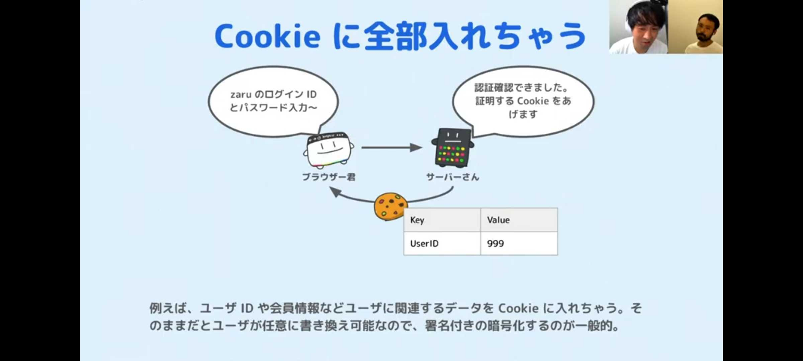
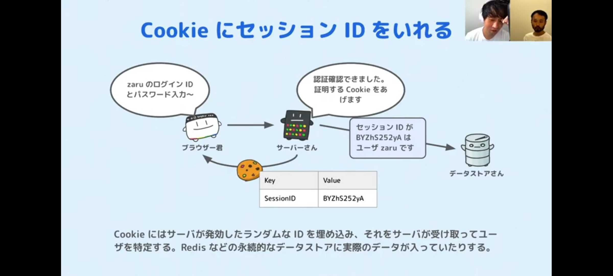
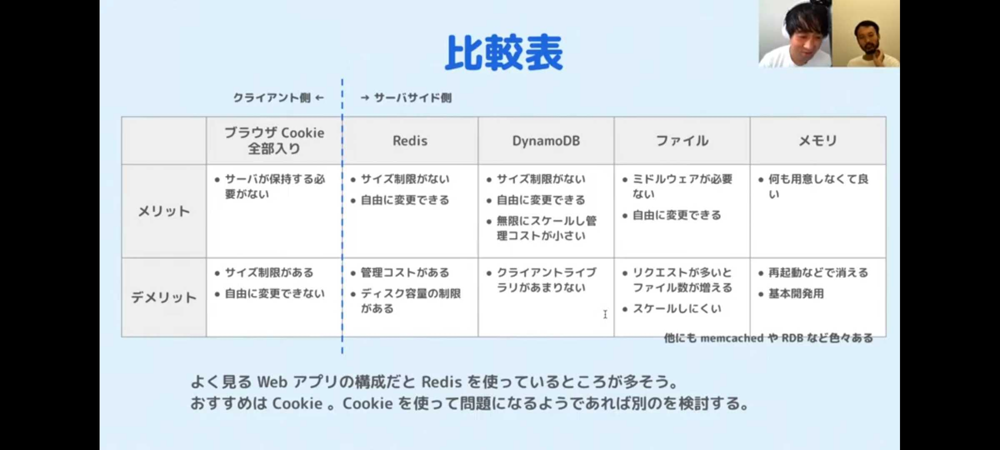
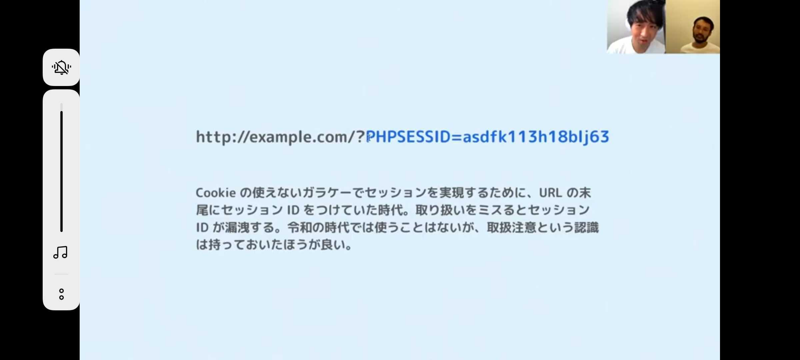
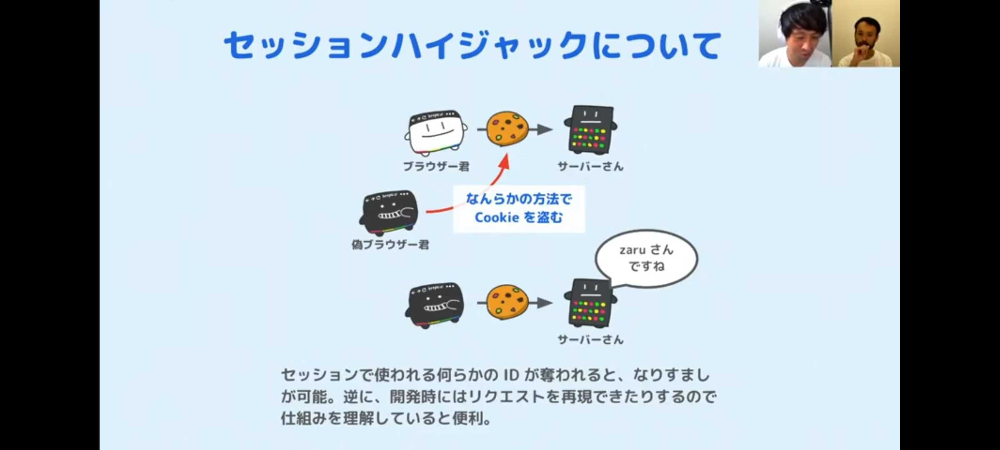

# クッキーとセッションのおさらい

クッキーとセッションって自分の言葉で説明できる状態ではなかったので、  
改めて時間を取って集中的に勉強をし、理解を深めることとした。  

## 勉強に使った教材

### 書籍

- プロになるためのWeb技術入門（Lesson4とLesson7のセッションハイジャックに係る部分）

### Qiita記事・Webサイトなど

- [Railsのセッション管理には何が最適か \- Qiita](https://qiita.com/shota_matsukawa_ga/items/a21c5cf49a1de6c9561a)
- [Session管理とRailsのcookie store](https://www.slideshare.net/carotene4035/sessionrailscookie-store)
- [Rails セキュリティガイド \- Railsガイド](https://railsguides.jp/security.html)

### Youtube動画

- [むーざるちゃんねる](https://youtu.be/EgUgmYLuLYE)
- [独学エンジニア（山浦さん）](https://www.youtube.com/watch?v=t8Xxp_dk214)

### だいそんさんの解説

- だいそんさんの動画（セッション・クッキーについて（1時間8分20秒頃から））
  - [動画本体](https://drive.google.com/file/d/1SKpqzVMKuRCTOBpxNSVHhCvUwvRWcRp5/view)
  - [動画のノート](https://github.com/miketa-webprgr/TIL/blob/master/99_etc/20200710_dyson_answers.md)
- だいそんさんの動画（Redisでセッションをどう管理しているのかの解説（52分50秒頃から））
  - [動画本体](https://drive.google.com/file/d/1iig_-sptxGbS7ebe1redEZt1S1nl3YVw/view)
  - [動画のノート](https://github.com/miketa-webprgr/TIL/blob/master/99_etc/20200628_dyson_answers.md)

## メモ

### クッキーとは

- cookieっていうのは、1passwordみたいな自動ログイン機能みたいなものと思うとよいかも。
- 意識していないけど、ログインした後、cookieはページにアクセスするたびにサーバーに送られている。
- ログインするたびにcookieを送っているということは、本質的には毎回ログインしているのと変わらない。(手間を省いてくれているだけ）
- cookieは、ログイン後にサーバーからクライアントに送られる。ブラウザはクッキーを保存し、それをアクセスの度に送り返している。
- cookieは食後に提供されるフォーチュンクッキー（アメリカの文化）が由来らしい。日本でいう、焼肉の後のガムみたいなもの。

### クッキーのリスク

ネットの世界っていうのは怖いらしく、詳しい人は通信が傍受できるらしい。  
あと、Cookieっていうのはブラウザに保存されるものなので、ハッキング的なことをされて盗まれるとやばい。  

- Cookieが盗まれたり、盗み見されたりすることを遅れて、何回もパスワードを発効し直したり、
- 不正使用されていないか確認するのは大変なので、Cookieがバレても比較的安心な仕組みを作った。
- それがセッションという仕組み。番号札のようなものだと捉えるとよい。

### セッションとは

- セッションは、１回のやり取りでしか使えない「使い捨ての鍵」みたいなもの。
- cookieに、ログインIDとパスワードを入れるのではなくて、セッションIDを入れてあげる。
- クライアントは、セッションIDをもってサーバーにアクセスする。
- サーバーは、セッションIDの管理表をもっているので、送られたきたセッションIDが管理表にあるか確認する。
- 照合できたら、ログインできているとみなす。
- 管理表ではセッションIDとユーザーIDを紐づけて保管しているので、DBの更新が必要な場合、管理表を活用する。

### セッションのリスク

ここで疑問が出てくるのが、「複雑な仕組みになったけれども、結局バレたらアウトでしょ」ということ。  
ここについては、そのとおり。以下のとおり理解すること。  

- 鍵であることには変わらないので、これが盗まれるとやばいことには変わらない。
- 銀行で番号札が盗まれて、代わりに通帳からお金が引き出されてしまうようなイメージ。
- ただ、この鍵は使用期限が短いので、有効期限が切れると使えなくなる。相対的に安全。

### セッション管理の方法

セッションIDはサーバー側で発行するものであり、ログインユーザーが何らかのページにアクセス  
する度に照合が必要になってくる。サーバー側で照合表の保管場所を確保する必要がある。  

- MySQLなどのデータベースサーバに保存する方法がある。あまり使われない。
- この場合、ActiveRecord-session_storeなるものを使う必要があるらしい。（勉強不足・・・）
- RedisというNonSQLサーバーを使う方法がある。こっちの方が早いらしい。
- メモリにデータを格納して、タイミングを見て、DBに保存する仕組み？らしい。

なお、Railsはクッキーストアという特殊な方法を採用しているらしい。  

- クッキーストアの場合、クッキーにセッションIDだけでなく関連情報も保存する。（ユーザーID・カート情報など）
- サーバー側には情報を保管しない。DBへのアクセスがないため、一番早い。
- クッキーは、サーバー側で暗号化されてから送信される。
- クライアントから送られたクッキーは、サーバー側で復号される。
- クッキーが盗まれたら、クッキーの有効期限が切れるまで対処方法がない。
- セッションハイジャックに対応するには、全てのクッキーを無効化して、暗号化の方法を変えるしかない。

むーざるちゃんねるさんが、分かりやすい図とともに紹介していた。  
ソースはこちら。（[むーざるちゃんねる](https://youtu.be/EgUgmYLuLYE))

   
   
   
   
   

### セッションを守るためのセキュリティ対策

セキュリティ周りについても勉強したので、少しメモを書いておく。  

- セッションが盗まれることは、セッションハイジャックという。
- セッションが盗まれないような対策として、以下のような対策がある。
  - 通信を暗号化する（HTTP通信をSSL通信にする）
  - セッションの期限を短くする
  - セッションのIDが予測されないようランダムに大きい数字を発行する
