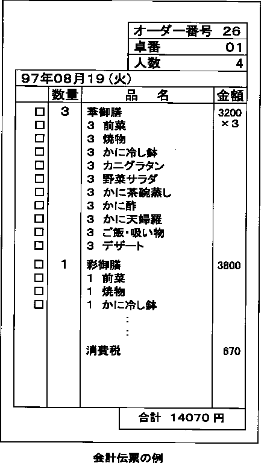

# 自己結合を使って、カレーセットとカレーを関係付けてみた

## はじめに

先日、東京の方でオフラインのもくもく会が開催されましたが、その際に話題となったのが「テーブル設計」でした。  
餃子の王将の注文書を見ながらテーブル設計を行うなど、実践的な練習を行いました。  

そこで、少しだけ話題となり、すぐに立ち消えになったのが「華御前」などのセットものが入った場合のテーブル設計です。  
「親子関係が入ると途端に難しくなるから」ということで、当日はこの領収書に関するテーブル設計や実装はあまり話題になりませんでしたが、  
JUNさんやDaiさんの発言などもあり、自己結合を使ってもいけそうといった話をして終わりになりました。  

<br>  

自己結合は、よくフォローとアンフォローの関係を表現する場合に使われます。  
ユーザー同士の関係性を表すので、「自己結合」と言うらしいです。  

Railsガイドでは、「1つのデータベースモデルに全従業員を格納しておきたいが、マネージャーと部下(subordinate)の関係も  
追えるようにしておきたい場合」が例として挙げられています。  

- [Active Record の関連付け \- Railsガイド](https://railsguides.jp/association_basics.html#%E8%87%AA%E5%B7%B1%E7%B5%90%E5%90%88)

「親子関係が入ると途端に難しくなるから」と言われると、なんとなく挑戦したくなります。  
ということで、「1つのデータベースモデルに全メニューを格納しておきたいが、『華御前』と『前菜』『焼物』『かに冷し鉢』・・・  
の関係も追えるようにしておきたい場合」のテーブル設計とアソシエーションの実装に挑戦してみました。  
（通常であれば、あまりセットメニューと単品メニューを同じテーブルに格納しないのでしょうけど）  

そこで、色々と明確になっていない点も多いのですが、課題点が見つかったのでみなさんに共有します。  

## 単純化してカレーセットとコーヒーセットしかない喫茶店を想定して考えてみる

あまり難しいことを考えても頭がパンクするので、とりあえず以下のメニューを提供している喫茶店を想定してみました。  
なお、カレーセットは「カレー・サラダ・コーヒー」、ケーキセットは「ケーキ・コーヒー」で構成されるものとします。  

|メニュー   |値段     |
|----------|-------:|
|カレーセット|   1,500|
|ケーキセット|     600|
|カレー     |   1,200|
|サラダ     |     300|
|コーヒー   |     300|
|ケーキ     |     400|

この場合、自己結合の考え方を使っても、カレーセットをカレー・サラダ・コーヒーに紐づけることができます。  
具体的には、こんな感じです。  

Menusテーブル  

|ID |メニュー   |値段     |set  |
|---|----------|-------:|-----|
|1  |カレーセット|   1,500| true|
|2  |ケーキセット|     600| true|
|3  |カレー     |   1,200|false|
|4  |サラダ     |     300|false|
|5  |コーヒー   |     300|false|
|6  |ケーキ     |     400|false|

Relationshipsテーブル  

|ID |menu_id(1) |menu_id(2) |
|---|----------:|----------:|
|1  |1          |          3|
|2  |1          |          4|
|3  |1          |          5|
|4  |2          |          5|
|5  |2          |          6|

少し解説すると、menu_id(1)にはカレーセットなどのセットメニューに関するidが入ります。  
menu_id(2)にはカレーやサラダなどのセットメニューに紐づくidが入ります。  

このようなテーブルを作ることによって、カレーセットに紐づく単品メニューのid [3, 4, 5] を取得することができるので、  
そのメニュー名である「カレー・サラダ・コーヒー」を取得することができます。  

逆に、コーヒーに紐づくセットメニューを取得することもできます。  
コーヒーのidは5なので、menu_id(2)に5が入っているレコードを参照します。  

すると、menu_id(1)には [1, 2] が入っているので、  
コーヒーに紐づくメニューとして、「カレーセット・ケーキセット」を取得することができます。  

なお、associationを行う上では、Menusテーブルにsetというカラムは不要なのですが、  
セットメニューであるか判別する上で便利だと思ったので、導入しました。  

## Railsアプリにおけるassociationの実装について

Schemaは下記のとおりとしました。  
命名は、ちょっと分かりづらいかったかもしれないです。  

なお、本来は外部キー制約を設ける方がベターなんですが、設定方法が少し特殊で勉強が必要であったため、  
とりあえず今回は外部キー制約を設けない形で実装を進めました。（自己結合は色々と面倒です・・・）  

```rb
ActiveRecord::Schema.define(version: 2020_11_07_134240) do

  create_table "items", force: :cascade do |t|
    t.string "menu"
    t.integer "price"
    t.boolean "set_menu", default: false, null: false
    t.datetime "created_at", precision: 6, null: false
    t.datetime "updated_at", precision: 6, null: false
  end

  create_table "relationships", force: :cascade do |t|
    t.integer "set_menu_id", null: false
    t.integer "food_id", null: false
    t.datetime "created_at", precision: 6, null: false
    t.datetime "updated_at", precision: 6, null: false
    t.index ["food_id"], name: "index_relationships_on_food_id"
    t.index ["set_menu_id"], name: "index_relationships_on_set_menu_id"
  end

end
```

次にItemモデルとRelationshipモデルですが、以下のとおり実装しました。  

```rb
class Item < ApplicationRecord
  # カレーセットに属するfood_idを取得するassociation
  has_many :food_relationships, class_name: 'Relationship', foreign_key: 'set_menu_id', dependent: :destroy

  # コーヒーが属するset_menu_idを取得するassociation
  has_many :set_menu_relationships, class_name: 'Relationship', foreign_key: 'food_id', dependent: :destroy

  # カレーセットからカレー・サラダ・コーヒーを取得する
  has_many :foods, through: :food_relationships, source: :food

  # カレーからカレーセットを取得する
  has_many :set_menus, through: :set_menu_relationships, source: :set_menu
end
```

```rb
class Relationship < ApplicationRecord
  belongs_to :food, class_name: 'Item'
  belongs_to :set_menu, class_name: 'Item'
end
```

Menusテーブル  

|ID |メニュー   |値段     |set  |
|---|----------|-------:|-----|
|1  |カレーセット|   1,500| true|
|2  |ケーキセット|     600| true|
|3  |カレー     |   1,200|false|
|4  |サラダ     |     300|false|
|5  |コーヒー   |     300|false|
|6  |ケーキ     |     400|false|

Relationshipsテーブル  

|ID |set_menu_id |food_id |
|---|----------:|----------:|
|1  |1          |          3|
|2  |1          |          4|
|3  |1          |          5|
|4  |2          |          5|
|5  |2          |          6|

## Associationの説明

前段部分と後段部分に分けて説明します。  

### Relationshipを取得するassociation

通常、has_manyにてassociationを定義する場合、Relationshipsテーブルにmenu_idというassociation元の外部キー  
を持たせることが一般的です。この場合、`has_many :relationships`と書くだけでいいので、シンプルに実装することができます。  

ただ、今回の場合、Relationshipsテーブルには外部キーを２つ設けており、それぞれをmenu_idという命名にするわけにいきません。  
そこで、外部キーをset_menu_idとfood_idという命名にしました。  

外部キーがassociation元のモデル名と異なるので、foreign_keyが何かを明示する必要があります。  
そこで、セットメニューから単品メニューのidを取得するassociationについては、`foreign_key: 'set_menu_id'`と明示しました。  
逆についても然りで、単品メニューからセットメニューのidを取得するassociationについては、`foreign_key: 'food_id'`と明示しました。

また、どちらのassociationについても、`has_many :relationships`と書いてしまうわけにはいかないので、  
それぞれ`has_many :food_relationships`及び`has_many :set_menu_relationships`といった形で別名をつけました。  

別名をつけると、どこのモデルを参照しているか不明になるため、`class_name: 'Relationship'`と明示しました。  

### Relationshipを通じて、紐づくMenusレコードを取得するassociation

これまで実装したassociationのみだと、紐づくidしか取得できず、本当に必要なメニュー名や値段を取得することができません。  
そこで、`has_many :foods, through: :food_relationships, source: :food`と記述する必要が出てきます。  

ここでは、既に実装したfood_relationshipsを使って、food_idに紐づく


あるので、has_manyでassociationを指定する場合、  
foreign_keyを指定する必要があります。  